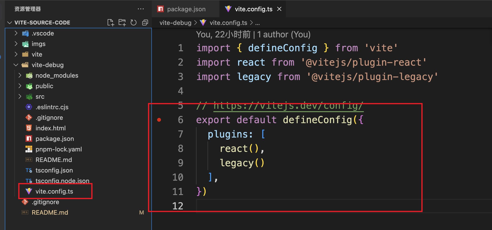
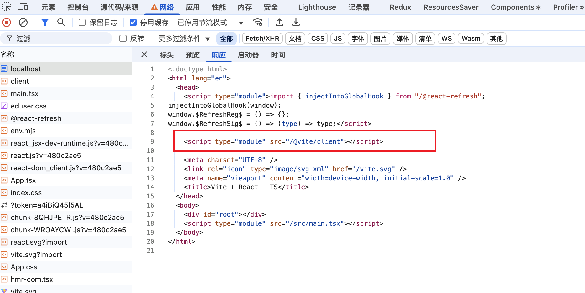
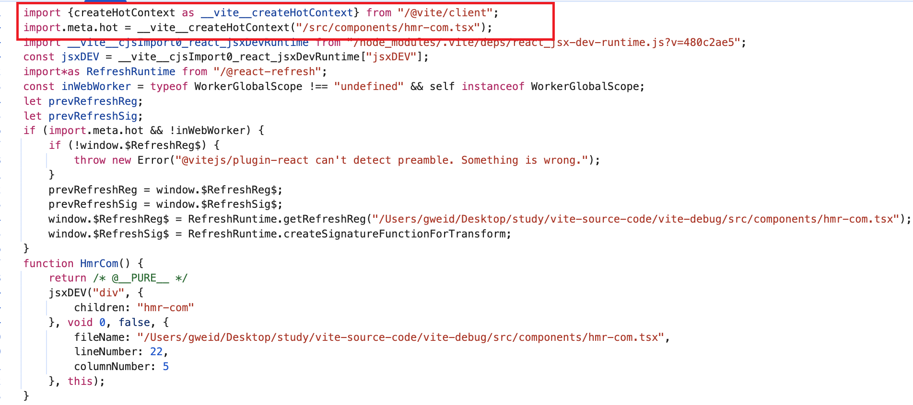
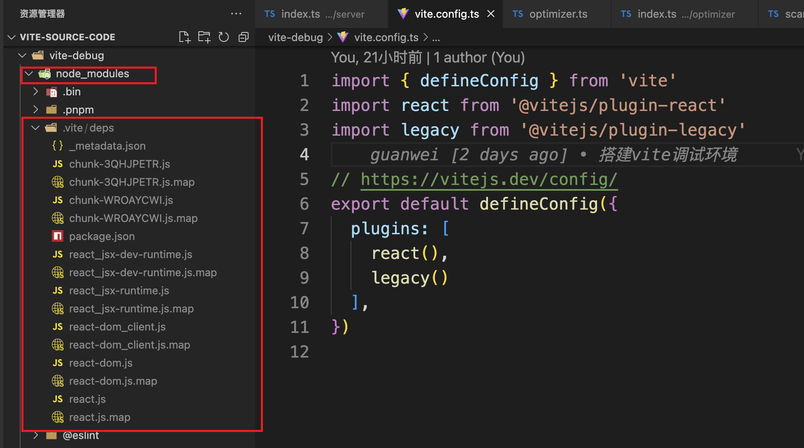

# vite 源码阅读

基于 vite@4.5.14 版本


一些优秀的文章：

- [前端之Vite原理](https://juejin.cn/post/7512657737726066723)


## 调试 vite

如果需要 debug 到 vite 源代码，而不是编译后的代码。需要

- 将 vite下载下来
- 开启 rollup.config.js 中的 sourcemap，并 build 构建出产物 dist
- 然后替换调试项目的 node_modules/vite/dist。


可以参考：https://juejin.cn/book/7070324244772716556/section/7159194044663332872


### 断点位置


#### vite.config.js 中断点




#### 源码中断点


首先，查看 vite

```js
"bin": {
  "vite": "bin/vite.js"
},
```


可以看到，vite 命令在 `bin/vite.js` 下


进入 `vite-debug/node_modules/vite/bin/vite.js` 下，主要使用 start 函数，启动打包：

```js
function start() {
  return import('../dist/node/cli.js')
}

start()
```


start 函数主要是引入了 `../dist/node/cli.js` 文件，进入这里文件，可以看到定义了一堆 Command 命令


如果是 dev 方式启动，那么找到：

```js
cli
    .command('[root]', 'start dev server') // default command
    .alias('serve') // the command is called 'serve' in Vite's API
    .alias('dev') // alias to align with the script name
    .option('--host [host]', `[string] specify hostname`, { type: [convertHost] })
    .option('--port <port>', `[number] specify port`)
    .option('--https', `[boolean] use TLS + HTTP/2`)
    .option('--open [path]', `[boolean | string] open browser on startup`)
    .option('--cors', `[boolean] enable CORS`)
    .option('--strictPort', `[boolean] exit if specified port is already in use`)
    .option('--force', `[boolean] force the optimizer to ignore the cache and re-bundle`)
    .action(async (root, options) => {
        filterDuplicateOptions(options);

        const { createServer } = await import('./chunks/dep-827b23df.js').then(function (n) { return n.J; });
        try {
            const server = await createServer({
                root,
                base: options.base,
                mode: options.mode,
                configFile: options.config,
                logLevel: options.logLevel,
                clearScreen: options.clearScreen,
                optimizeDeps: { force: options.force },
                server: cleanOptions(options),
            });

        }
        catch (e) {

        }
});
```

在这里面打断点即可


如果是 build 命令，找到：

```js
cli
    .command('build [root]', 'build for production')
    .option('--target <target>', `[string] transpile target (default: 'modules')`)
    .option('--outDir <dir>', `[string] output directory (default: dist)`)
    .option('--assetsDir <dir>', `[string] directory under outDir to place assets in (default: assets)`)
    .option('--assetsInlineLimit <number>', `[number] static asset base64 inline threshold in bytes (default: 4096)`)
    .option('--ssr [entry]', `[string] build specified entry for server-side rendering`)
    .option('--sourcemap [output]', `[boolean | "inline" | "hidden"] output source maps for build (default: false)`)
    .option('--minify [minifier]', `[boolean | "terser" | "esbuild"] enable/disable minification, ` +
    `or specify minifier to use (default: esbuild)`)
    .option('--manifest [name]', `[boolean | string] emit build manifest json`)
    .option('--ssrManifest [name]', `[boolean | string] emit ssr manifest json`)
    .option('--force', `[boolean] force the optimizer to ignore the cache and re-bundle (experimental)`)
    .option('--emptyOutDir', `[boolean] force empty outDir when it's outside of root`)
    .option('-w, --watch', `[boolean] rebuilds when modules have changed on disk`)
    .action(async (root, options) => {

        filterDuplicateOptions(options);
        const { build } = await import('./chunks/dep-827b23df.js').then(function (n) { return n.I; });
        const buildOptions = cleanOptions(options);
        try {
            await build({
                root,
                base: options.base,
                mode: options.mode,
                configFile: options.config,
                logLevel: options.logLevel,
                clearScreen: options.clearScreen,
                optimizeDeps: { force: options.force },
                build: buildOptions,
            });
        }
        catch (e) {
            createLogger(options.logLevel).error(colors.red(`error during build:\n${e.stack}`), { error: e });
            process.exit(1);
        }
        finally {
            stopProfiler((message) => createLogger(options.logLevel).info(message));
        }
});
```

在这里面打断点即可


## 目录结构

```text
vite-source-code
├── vite                         // vite 源码
├── vite-debug                   // 调试 vite 源码的项目
│   ├── src
│   │   ├── App.tsx
│   ├── package.json
│   ├── pnpm-lock.yaml
│   └── vite.config.js
├── .gitignore
└── readme.md
```


## Vite 源码


### createServer

`createServer` 是 Vite 的核心，它整合了配置解析、插件系统、模块转换、HMR、文件监听等所有开发时需要的功能，为开发提供了快速、高效的开发服务器。


#### npm run dev 启动


在 package.json 文件中：

```json
"scripts": {
  "dev": "vite",
  "build": "tsc && vite build",
  "lint": "eslint . --ext ts,tsx --report-unused-disable-directives --max-warnings 0",
  "preview": "vite preview"
},
```


当执行 `npm run dev` 命令时，会执行 vite。这个 vite 会执行 `vite/packages/vite/src/node/cli.ts` 下

```js
// dev
cli
  .command('[root]', 'start dev server') // default command
  .alias('serve') // the command is called 'serve' in Vite's API
  .alias('dev') // alias to align with the script name
  .option('--host [host]', `[string] specify hostname`, { type: [convertHost] })
  .option('--port <port>', `[number] specify port`)
  .option('--https', `[boolean] use TLS + HTTP/2`)
  .option('--open [path]', `[boolean | string] open browser on startup`)
  .option('--cors', `[boolean] enable CORS`)
  .option('--strictPort', `[boolean] exit if specified port is already in use`)
  .option(
    '--force',
    `[boolean] force the optimizer to ignore the cache and re-bundle`,
  )
  .action(async (root: string, options: ServerOptions & GlobalCLIOptions) => {
    	filterDuplicateOptions(options)

      const { createServer } = await import('./server')
      try {

        // 通过 createServer 创建一个 server 对象
        const server = await createServer({
          root,
          base: options.base,
          mode: options.mode,
          configFile: options.config,
          logLevel: options.logLevel,
          clearScreen: options.clearScreen,
          optimizeDeps: { force: options.force },
          // 执行 createServer 之前，先执行了 cleanOptions 函数，规范化用户的命令输入
          server: cleanOptions(options),
        })

    } catch (e) {
      // ...
    }
  })
```


可以看到，通过 createServer 创建一个 server 对象。


#### createServer 逻辑

>  vite/packages/vite/src/node/server/index.ts

```js 
export function createServer(inlineConfig = {}) {
    return _createServer(inlineConfig, { ws: true });
}


export async function _createServer(
  inlineConfig: InlineConfig = {},
  options: { ws: boolean },
): Promise<ViteDevServer> {
  // ...
}
```

整个 createServer 的逻辑集中在了 _createServer 函数中


**_createServer 函数解释：**

>  vite/packages/vite/src/node/server/index.ts

```js
export async function _createServer(
  inlineConfig: InlineConfig = {},
  options: { ws: boolean },
): Promise<ViteDevServer> {
  //  解析和标准化用户配置，将命令行参数、配置文件（vite.config.js）和默认配置合并为统一的 ResolvedConfig 对象
  const config = await resolveConfig(inlineConfig, 'serve')

  const { root, server: serverConfig } = config

  // resolveHttpsConfig 处理是否开启 https
  // 如果开启了 https，会加载证书（支持自定义或自动生成）
  const httpsOptions = await resolveHttpsConfig(config.server.https)

  // middlewareMode：以中间件模式创建 Vite 服务器
  // 主要用于与后端服务集成、ssr 等
  const { middlewareMode } = serverConfig

  const resolvedWatchOptions = resolveChokidarOptions(config, {
    disableGlobbing: true,
    ...serverConfig.watch,
  })

  // connect 是一个中间件框架，Express 的中间件就是基于 connect 的
  // const app = connect();
  // app.use((req, res, next) => {
  //   console.log(`${req.method} ${req.url}`);
  //   next();
  // })
  const middlewares = connect() as Connect.Server

  // resolveHttpServer 用于 ​​创建和配置 HTTP/HTTPS 服务器实例​​ 的核心函数
  // 根据用户配置（server.https 和 server.proxy 等）生成一个可用的 Node.js HTTP 或 HTTPS、HTTP2 服务器
  const httpServer = middlewareMode
    ? null
    : await resolveHttpServer(serverConfig, middlewares, httpsOptions)

  // 创建一个 websocket 服务器（与 HMR 模块热更新相关）
  const ws = createWebSocketServer(httpServer, config, httpsOptions)

  if (httpServer) {
    setClientErrorHandler(httpServer, config.logger)
  }

  // chokidar 是一个文件监听库，用于监听文件变化
  const watcher = chokidar.watch(
    // config file dependencies and env file might be outside of root
    [root, ...config.configFileDependencies, config.envDir],
    resolvedWatchOptions,
  ) as FSWatcher

  // 创建一个模块依赖图（记录模块之间的关系）
  const moduleGraph: ModuleGraph = new ModuleGraph((url, ssr) =>
    container.resolveId(url, undefined, { ssr }),
  )

  // 创建一个 pluginContainer
  // 开发环境中，Vite 模拟了 Rollup 的插件机制，设计了一个 PluginContainer 对象来调度各个插件
  const container = await createPluginContainer(config, moduleGraph, watcher)

  // 创建一个关闭 http 服务器的函数
  const closeHttpServer = createServerCloseFn(httpServer)

  let exitProcess: () => void

  // 创建一个 server 对象
  const server: ViteDevServer = {
    config,
    middlewares,
    httpServer,
    watcher,
    pluginContainer: container,
    ws,
    moduleGraph,
    resolvedUrls: null, // will be set on listen
    ssrTransform(
      code: string,
      inMap: SourceMap | null,
      url: string,
      originalCode = code,
    ) {
      return ssrTransform(code, inMap, url, originalCode, server.config)
    },
    transformRequest(url, options) {
      return transformRequest(url, server, options)
    },
    transformIndexHtml: null!, // to be immediately set
    async ssrLoadModule(url, opts?: { fixStacktrace?: boolean }) {
      if (isDepsOptimizerEnabled(config, true)) {
        await initDevSsrDepsOptimizer(config, server)
      }
      if (config.legacy?.buildSsrCjsExternalHeuristics) {
        await updateCjsSsrExternals(server)
      }
      return ssrLoadModule(
        url,
        server,
        undefined,
        undefined,
        opts?.fixStacktrace,
      )
    },
    ssrFixStacktrace(e) {
      ssrFixStacktrace(e, moduleGraph)
    },
    ssrRewriteStacktrace(stack: string) {
      return ssrRewriteStacktrace(stack, moduleGraph)
    },
    async reloadModule(module) {
      if (serverConfig.hmr !== false && module.file) {
        updateModules(module.file, [module], Date.now(), server)
      }
    },
    // 启动 http 服务
    async listen(port?: number, isRestart?: boolean) {
      await startServer(server, port)
      if (httpServer) {
        server.resolvedUrls = await resolveServerUrls(
          httpServer,
          config.server,
          config,
        )
        if (!isRestart && config.server.open) server.openBrowser()
      }
      return server
    },
    // 自动打开浏览器
    openBrowser() {
      const options = server.config.server
      const url =
        server.resolvedUrls?.local[0] ?? server.resolvedUrls?.network[0]
      if (url) {
        const path =
          typeof options.open === 'string'
            ? new URL(options.open, url).href
            : url

        _openBrowser(path, true, server.config.logger)
      } else {
        server.config.logger.warn('No URL available to open in browser')
      }
    },
    async close() {
      if (!middlewareMode) {
        process.off('SIGTERM', exitProcess)
        if (process.env.CI !== 'true') {
          process.stdin.off('end', exitProcess)
        }
      }
      await Promise.allSettled([
        watcher.close(),
        ws.close(),
        container.close(),
        getDepsOptimizer(server.config)?.close(),
        getDepsOptimizer(server.config, true)?.close(),
        closeHttpServer(),
      ])

      while (server._pendingRequests.size > 0) {
        await Promise.allSettled(
          [...server._pendingRequests.values()].map(
            (pending) => pending.request,
          ),
        )
      }
      server.resolvedUrls = null
    },
    printUrls() {
      if (server.resolvedUrls) {
        printServerUrls(
          server.resolvedUrls,
          serverConfig.host,
          config.logger.info,
        )
      } else if (middlewareMode) {
        throw new Error('cannot print server URLs in middleware mode.')
      } else {
        throw new Error(
          'cannot print server URLs before server.listen is called.',
        )
      }
    },
    async restart(forceOptimize?: boolean) {
      if (!server._restartPromise) {
        server._forceOptimizeOnRestart = !!forceOptimize
        server._restartPromise = restartServer(server).finally(() => {
          server._restartPromise = null
          server._forceOptimizeOnRestart = false
        })
      }
      return server._restartPromise
    },

    _ssrExternals: null,
    _restartPromise: null,
    _importGlobMap: new Map(),
    _forceOptimizeOnRestart: false,
    _pendingRequests: new Map(),
    _fsDenyGlob: picomatch(
      config.server.fs.deny.map((pattern) =>
        pattern.includes('/') ? pattern : `**/${pattern}`,
      ),
      {
        matchBase: false,
        nocase: true,
        dot: true,
      },
    ),
    _shortcutsOptions: undefined,
  }

  // 插件如果使用了这个钩子，会在这里出发
  server.transformIndexHtml = createDevHtmlTransformFn(server)

  if (!middlewareMode) {
    exitProcess = async () => {
      try {
        await server.close()
      } finally {
        process.exit()
      }
    }
    process.once('SIGTERM', exitProcess)
    if (process.env.CI !== 'true') {
      process.stdin.on('end', exitProcess)
    }
  }

  // 触发 HMR 更新
  const onHMRUpdate = async (file: string, configOnly: boolean) => {
    if (serverConfig.hmr !== false) {
      try {
        await handleHMRUpdate(file, server, configOnly)
      } catch (err) {
        ws.send({
          type: 'error',
          err: prepareError(err),
        })
      }
    }
  }

  const onFileAddUnlink = async (file: string) => {
    file = normalizePath(file)
    await handleFileAddUnlink(file, server)
    await onHMRUpdate(file, true)
  }

  // 监听文件变化
  watcher.on('change', async (file) => {
    file = normalizePath(file)
    // invalidate module graph cache on file change
    moduleGraph.onFileChange(file)

    // 触发 HMR 更新
    await onHMRUpdate(file, false)
  })

  // 监听文件添加
  watcher.on('add', onFileAddUnlink)
  // 监听文件删除
  watcher.on('unlink', onFileAddUnlink)

  // 通过 vite:invalidate 事件通知浏览器，哪些模块需要失效
  ws.on('vite:invalidate', async ({ path, message }: InvalidatePayload) => {
    const mod = moduleGraph.urlToModuleMap.get(path)
    if (mod && mod.isSelfAccepting && mod.lastHMRTimestamp > 0) {
      config.logger.info(
        colors.yellow(`hmr invalidate `) +
          colors.dim(path) +
          (message ? ` ${message}` : ''),
        { timestamp: true },
      )
      const file = getShortName(mod.file!, config.root)
      updateModules(
        file,
        [...mod.importers],
        mod.lastHMRTimestamp,
        server,
        true,
      )
    }
  })

  if (!middlewareMode && httpServer) {
    httpServer.once('listening', () => {
      // update actual port since this may be different from initial value
      serverConfig.port = (httpServer.address() as net.AddressInfo).port
    })
  }

  /**
   * config.getSortedPluginHooks('configureServer')： 获取所有插件中注册的 configureServer 钩子函数，按插件顺序排序（遵循 Vite 的插件顺序规则，如 pre/normal/post 阶段）
   * 
   * hook(server)： 执行插件中的 configureServer 钩子函数
   * 
   * postHooks.push：收集钩子函数可能返回的清理函数（() => void）。如果钩子未返回内容（void），则忽略
   *  - 每个 configureServer 钩子可以返回一个函数（也可以不返回）
   *  - 返回的函数会被收集到 postHooks 数组中
   *  - 这些函数会在服务器中间件安装完成后执行
   */
  const postHooks: ((() => void) | void)[] = []
  for (const hook of config.getSortedPluginHooks('configureServer')) {
    postHooks.push(await hook(server))
  }

  // Internal middlewares ------------------------------------------------------
  // 这后面就是使用中间件，处理请求
  // vite 从 <script type="module" src="/src/main.tsx"></script> 这个入口开始解析
  // 每当有一个 import，就有一个请求，下面的中间件就是处理这些请求的

  // request timer
  if (process.env.DEBUG) {
    middlewares.use(timeMiddleware(root))
  }

  // disallows request that contains `#` in the URL
  middlewares.use(rejectInvalidRequestMiddleware())

  // 处理 cors
  const { cors } = serverConfig
  if (cors !== false) {
    middlewares.use(
      corsMiddleware(
        typeof cors === 'boolean'
          ? {}
          : cors ?? { origin: defaultAllowedOrigins },
      ),
    )
  }

  const { allowedHosts } = serverConfig
  if (allowedHosts !== true && !serverConfig.https) {
    middlewares.use(hostCheckMiddleware(config, false))
  }

  // proxy
  const { proxy } = serverConfig
  if (proxy) {
    middlewares.use(proxyMiddleware(httpServer, proxy, config))
  }

  // base
  if (config.base !== '/') {
    middlewares.use(baseMiddleware(server))
  }

  // open in editor support
  middlewares.use('/__open-in-editor', launchEditorMiddleware())

  // ping request handler
  // Keep the named function. The name is visible in debug logs via `DEBUG=connect:dispatcher ...`
  middlewares.use(function viteHMRPingMiddleware(req, res, next) {
    if (req.headers['accept'] === 'text/x-vite-ping') {
      res.writeHead(204).end()
    } else {
      next()
    }
  })

  // 处理 public 目录下的静态文件
  if (config.publicDir) {
    middlewares.use(
      servePublicMiddleware(config.publicDir, server, config.server.headers),
    )
  }

  // main transform middleware
  // 对模块进行编译
  middlewares.use(transformMiddleware(server))

  // serve static files
  middlewares.use(serveRawFsMiddleware(server))
  middlewares.use(serveStaticMiddleware(root, server))

  // html fallback
  if (config.appType === 'spa' || config.appType === 'mpa') {
    middlewares.use(htmlFallbackMiddleware(root, config.appType === 'spa'))
  }

  // 执行上面收集到的 configureServer 钩子函数返回的回调函数
  postHooks.forEach((fn) => fn && fn())

  // spa 或 mpa 应用
  if (config.appType === 'spa' || config.appType === 'mpa') {
    // transform index.html
    middlewares.use(indexHtmlMiddleware(server))

    // 处理路由刷新 404 问题
    middlewares.use(function vite404Middleware(_, res) {
      res.statusCode = 404
      res.end()
    })
  }

  // error handler
  middlewares.use(errorMiddleware(server, middlewareMode))

  // 通过 serverInited 和 initingServer 两个标志位，避免并发调用导致的重复初始化
  let initingServer: Promise<void> | undefined
  let serverInited = false
  const initServer = async () => {
    // 如果服务器已经初始化，则返回
    if (serverInited) return
    // 如果服务器正在初始化，则返回正在初始化的 Promise
    if (initingServer) return initingServer

    initingServer = (async function () {
      // 执行插件的 buildStart 钩子
      await container.buildStart({})
      // start deps optimizer after all container plugins are ready
      if (isDepsOptimizerEnabled(config, false)) {
        // 依赖预构建：如果启用了依赖预构建，调用 initDepsOptimizer 预编译 node_modules 中的依赖
        await initDepsOptimizer(config, server)
      }
      initingServer = undefined
      serverInited = true
    })()
    return initingServer
  }

  if (!middlewareMode && httpServer) {
    const listen = httpServer.listen.bind(httpServer)
    // 当浏览器访问开发服务器时，Vite 在响应请求前会调用 httpServer.listen 方法
    httpServer.listen = (async (port: number, ...args: any[]) => {
      try {
        // ensure ws server started
        // 开启 websocket 服务
        ws.listen()
        await initServer()
      } catch (e) {
        httpServer.emit('error', e)
        return
      }
      return listen(port, ...args)
    }) as any
  } else {
    if (options.ws) {
      ws.listen()
    }
    await initServer()
  }

  // 将创建的 server 对象返回
  return server
}
```


_createServer 函数流程：

1. 通过 resolveConfig 结合用户输入的命令，以及 vite.config.js 和默认配置，生成一个 config 对象

2. 通过 resolveHttpsConfig 处理配置是否开启 https

3. 通过 connect 创建中间件

   - connect 是一个中间件框架，Express 的中间件就是基于 connect 的。基本使用

     ```js
     const app = connect();
     
     app.use((req, res, next) => {
       console.log(`${req.method} ${req.url}`);
       next();
     })
     ```

4. resolveHttpServer 根据场景，创建服务器

   - 没有开启 https，那么使用 http 创建一个服务器
   - 开启了 https，使用 http2 创建一个服务器
   - 开启了 https，同时开启了 proxy，回退使用 https 创建一个服务器

5. 通过 createWebSocketServer 创建一个 websocket 服务器（与 HMR 相关）

6. 通过 chokidar.watch 创建文件变化监听器

   - chokidar 是一个文件监听库，用于监听文件变化

7. 通过 new ModuleGraph 创建模块依赖图，记录模块之间的关系

8. 通过 createPluginContainer 创建 pluginContainer

   - 开发环境中，Vite 模拟了 Rollup 的插件机制，设计了一个 PluginContainer 对象来调度各个插件

9. 创建 server 对象，包含以下属性：

   ```js
   const server: ViteDevServer = {
     config,
     middlewares,
     httpServer,
     watcher,
     pluginContainer: container,
     ws,
     moduleGraph,
     resolvedUrls: null, // will be set on listen
     ssrTransform(
       code: string,
       inMap: SourceMap | null,
       url: string,
       originalCode = code,
     ) {
       return ssrTransform(code, inMap, url, originalCode, server.config)
     },
     transformRequest(url, options) {
       return transformRequest(url, server, options)
     },
     transformIndexHtml: null!, // to be immediately set
     async ssrLoadModule(url, opts?: { fixStacktrace?: boolean }) {
   
     },
     ssrFixStacktrace(e) {
       ssrFixStacktrace(e, moduleGraph)
     },
     ssrRewriteStacktrace(stack: string) {
       return ssrRewriteStacktrace(stack, moduleGraph)
     },
     async reloadModule(module) {
   
     },
     // 启动 http 服务
     async listen(port?: number, isRestart?: boolean) {
   
     },
     // 自动打开浏览器
     openBrowser() {
   
     },
     async close() {
   
     },
     printUrls() {
   
     },
     async restart(forceOptimize?: boolean) {
   
     },
   }
   ```

10. 通过 `watcher.on('change'`、`watcher.on('add'`、`watcher.on('unlink'` 监听文件变化，更新依赖图，触发 HMR 更新

11. 处理插件的 configureServer 钩子

    ```js
    /**
     * config.getSortedPluginHooks('configureServer')： 获取所有插件中注册的 configureServer 钩子函数，按插件顺序排序（遵循 Vite 的插件顺序规则，如 pre/normal/post 阶段）
     * 
     * hook(server)： 执行插件中的 configureServer 钩子函数
     * 
     * postHooks.push：收集钩子函数可能返回的回调函数。如果钩子未返回内容（void），则忽略
     *  - 每个 configureServer 钩子可以返回一个函数（也可以不返回）
     *  - 返回的函数会被收集到 postHooks 数组中
     *  - 这些函数会在服务器中间件安装完成后执行
     */
    const postHooks: ((() => void) | void)[] = []
    for (const hook of config.getSortedPluginHooks('configureServer')) {
      postHooks.push(await hook(server))
    }
    ```

12. 后面就是各种 middlewares.use，这后面就是使用中间件，处理请求。

    - vite 从`<script type="module" src="/src/main.tsx"></script>` 这个入口开始解析
    - 每当有一个 import，就有一个请求，下面的中间件就是处理这些请求的
    - 比如：middlewares.use(transformMiddleware(server)) 这个会对模块进行编译

13. 最后，通过 httpServer.listen 启动服务器监听

    - 当浏览器访问开发服务器时，vite 便会调用监听函数
    - 监听函数主要做的事：
      - 开启 ws 服务
      - 执行插件 buildStart 钩子
      - 如果开启了依赖与构建，调用 initDepsOptimizer 预构建第三方模块


#### createServer 总结

| **功能模块**   | **作用**                                                     |
| -------------- | ------------------------------------------------------------ |
| 解释合并配置   | 将命令行参数、配置文件（vite.config.js）和默认配置合并为统一的配置 |
| 服务器实例化   | 创建 HTTP/HTTPS 服务器，支持 HTTP/2 和代理配置               |
| 模块依赖图     | 构建 `ModuleGraph` 管理模块间的依赖关系，实现精准 HMR        |
| 插件系统初始化 | 加载并排序插件，执行 `configureServer` 等钩子                |
| 中间件流水线   | 挂载代码转换、静态资源服务、代理等中间件                     |
| WebSocket 服务 | 建立 HMR 通信通道，实现浏览器与服务器的实时交互              |
| 文件监听       | 通过 `chokidar` 监听文件变动，触发模块重编译和热更新         |
| 依赖预构建     | 预编译 node_modules 中的依赖                                 |


### resolveConfig

主要作用：解析和标准化用户配置，将命令行参数、配置文件（vite.config.js）和默认配置合并为统一的 ResolvedConfig 对象


#### resolveConfig 函数

> vite/packages/vite/src/node/config.ts

```js
export async function resolveConfig(
  inlineConfig: InlineConfig, // 命令行配置
  command: 'build' | 'serve',
  defaultMode = 'development',
  defaultNodeEnv = 'development',
): Promise<ResolvedConfig> {
  // ! 命令行配置
  let config = inlineConfig
  let configFileDependencies: string[] = []
  let mode = inlineConfig.mode || defaultMode

  // ! 判断是否设置了 NODE_ENV
  const isNodeEnvSet = !!process.env.NODE_ENV
  const packageCache: PackageCache = new Map()

  // ! 没有设置 NODE_ENV 时，设置为默认环境
  if (!isNodeEnvSet) {
    process.env.NODE_ENV = defaultNodeEnv
  }

  const configEnv = {
    mode,
    command,
    ssrBuild: !!config.build?.ssr,
  }

  let { configFile } = config
  if (configFile !== false) {
    // ! 加载 vite.config.js 配置文件
    const loadResult = await loadConfigFromFile(
      configEnv,
      configFile,
      config.root,
      config.logLevel,
    )

    if (loadResult) {
      // ! 合并命令行配置和 vite.config.js 配置
      config = mergeConfig(loadResult.config, config)
      configFile = loadResult.path
      configFileDependencies = loadResult.dependencies
    }
  }

  // ! 命令行的 mode 优先级高于 vite.config.js 的 mode
  mode = inlineConfig.mode || config.mode || mode
  configEnv.mode = mode

  const filterPlugin = (p: Plugin) => {
    if (!p) {
      return false
    } else if (!p.apply) {
      return true
    } else if (typeof p.apply === 'function') {
      return p.apply({ ...config, mode }, configEnv)
    } else {
      return p.apply === command
    }
  }

  // ! 从配置中提取并过滤出适用于 Worker 环境的插件列表。明确区分 Worker 和主线程的插件
  const rawWorkerUserPlugins = (
    (await asyncFlatten(config.worker?.plugins || [])) as Plugin[]
  ).filter(filterPlugin)

  // resolve plugins
  // ! 将配置的插件（config.plugins）进行​​扁平化、过滤无效项​​，最终生成一个纯净的插件数组
  // 可能是 plugins = [ plugin1, [plugin2] ]
  const rawUserPlugins = (
    (await asyncFlatten(config.plugins || [])) as Plugin[]
  ).filter(filterPlugin)

  // ! sortUserPlugins 会根据 enforce 属性，将插件分为 pre、normal、post 三类
  const [prePlugins, normalPlugins, postPlugins] =
    sortUserPlugins(rawUserPlugins)

  // ! 将 pre、normal、post 三类插件合并为一个数组，这样就实现了排序
  // 插件执行顺序：prePlugins -> normalPlugins -> postPlugins
  const userPlugins = [...prePlugins, ...normalPlugins, ...postPlugins]

  // ! 执行所有插件的 config 钩子
  config = await runConfigHook(config, userPlugins, configEnv)

  if (
    !config.build?.commonjsOptions &&
    process.env.VITE_TEST_WITHOUT_PLUGIN_COMMONJS
  ) {
    config = mergeConfig(config, {
      optimizeDeps: { disabled: false },
      ssr: { optimizeDeps: { disabled: false } },
    })
    config.build ??= {}
    config.build.commonjsOptions = { include: [] }
  }

  // Define logger
  const logger = createLogger(config.logLevel, {
    allowClearScreen: config.clearScreen,
    customLogger: config.customLogger,
  })

  // resolve root
  const resolvedRoot = normalizePath(
    config.root ? path.resolve(config.root) : process.cwd(),
  )

  // ! 默认的 alias
  const clientAlias = [
    {
      find: /^\/?@vite\/env/,
      replacement: path.posix.join(FS_PREFIX, normalizePath(ENV_ENTRY)),
    },
    {
      find: /^\/?@vite\/client/,
      replacement: path.posix.join(FS_PREFIX, normalizePath(CLIENT_ENTRY)),
    },
  ]

  // resolve alias with internal client alias
  // ! 将 vite.config.js 的 alias 和 默认的 alias 合并
  const resolvedAlias = normalizeAlias(
    mergeAlias(clientAlias, config.resolve?.alias || []),
  )

  // ! Vite 中模块解析配置对象的初始化，它定义了 Vite 如何解析和查找模块文件
  const resolveOptions: ResolvedConfig['resolve'] = {
    mainFields: config.resolve?.mainFields ?? DEFAULT_MAIN_FIELDS,
    browserField: config.resolve?.browserField ?? true,
    conditions: config.resolve?.conditions ?? [],
    extensions: config.resolve?.extensions ?? DEFAULT_EXTENSIONS,
    dedupe: config.resolve?.dedupe ?? [],
    preserveSymlinks: config.resolve?.preserveSymlinks ?? false,
    alias: resolvedAlias,
  }

  // load .env files
  // ! 加载对应的 .env 文件
  const envDir = config.envDir
    ? normalizePath(path.resolve(resolvedRoot, config.envDir))
    : resolvedRoot
  const userEnv =
    inlineConfig.envFile !== false &&
    loadEnv(mode, envDir, resolveEnvPrefix(config))

  const userNodeEnv = process.env.VITE_USER_NODE_ENV
  if (!isNodeEnvSet && userNodeEnv) {
    if (userNodeEnv === 'development') {
      process.env.NODE_ENV = 'development'
    } else {
      // NODE_ENV=production is not supported as it could break HMR in dev for frameworks like Vue
      logger.warn(
        `NODE_ENV=${userNodeEnv} is not supported in the .env file. ` +
          `Only NODE_ENV=development is supported to create a development build of your project. ` +
          `If you need to set process.env.NODE_ENV, you can set it in the Vite config instead.`,
      )
    }
  }

  // ! 判断是否是生产环境
  const isProduction = process.env.NODE_ENV === 'production'

  // resolve public base url
  const isBuild = command === 'build'
  const relativeBaseShortcut = config.base === '' || config.base === './'

  // During dev, we ignore relative base and fallback to '/'
  // For the SSR build, relative base isn't possible by means
  // of import.meta.url.
  // ! 处理 base
  const resolvedBase = relativeBaseShortcut
    ? !isBuild || config.build?.ssr
      ? '/'
      : './'
    : resolveBaseUrl(config.base, isBuild, logger) ?? '/'

  /**
   * ! 通过 resolveBuildOptions 生成一个构建配置对象(config.build)
   * 
   * build: {
   *   assetsInlineLimit: 8 *1024,
   *   rollupOptions: {
   *     output: {
   *       manualChunks: {
   *         'react-vendor': ['react', 'react-dom']
   *     }
   *   }
   * }
  }
   */
  const resolvedBuildOptions = resolveBuildOptions(
    config.build,
    logger,
    resolvedRoot,
  )

  // resolve cache directory
  // ! 设置缓存目录。如果有设置 config.cacheDir，使用设置的，没有，使用默认的 node_modules/.vite
  const pkgDir = findNearestPackageData(resolvedRoot, packageCache)?.dir
  const cacheDir = normalizePath(
    config.cacheDir
      ? path.resolve(resolvedRoot, config.cacheDir)
      : pkgDir
      ? path.join(pkgDir, `node_modules/.vite`)
      : path.join(resolvedRoot, `.vite`),
  )

  // ! 处理 assetsInclude
  // ! assetsInclude 作用：配置 vite 可以额外解析哪些静态文件（vite有默认支持的文件类型）
  const assetsFilter =
    config.assetsInclude &&
    (!Array.isArray(config.assetsInclude) || config.assetsInclude.length)
      ? createFilter(config.assetsInclude)
      : () => false

  // ! 用于创建内部模块解析器，主要用于特殊场景如依赖优化和处理 CSS @imports
  const createResolver: ResolvedConfig['createResolver'] = (options) => {
    let aliasContainer: PluginContainer | undefined
    let resolverContainer: PluginContainer | undefined
    return async (id, importer, aliasOnly, ssr) => {
      let container: PluginContainer
      if (aliasOnly) {
        container =
          aliasContainer ||
          (aliasContainer = await createPluginContainer({
            ...resolved,
            plugins: [aliasPlugin({ entries: resolved.resolve.alias })],
          }))
      } else {
        container =
          resolverContainer ||
          (resolverContainer = await createPluginContainer({
            ...resolved,
            plugins: [
              aliasPlugin({ entries: resolved.resolve.alias }),
              resolvePlugin({
                ...resolved.resolve,
                root: resolvedRoot,
                isProduction,
                isBuild: command === 'build',
                ssrConfig: resolved.ssr,
                asSrc: true,
                preferRelative: false,
                tryIndex: true,
                ...options,
                idOnly: true,
              }),
            ],
          }))
      }
      return (
        await container.resolveId(id, importer, {
          ssr,
          scan: options?.scan,
        })
      )?.id
    }
  }

  // ! 处理 config.publicDir，默认使用 public
  const { publicDir } = config
  const resolvedPublicDir =
    publicDir !== false && publicDir !== ''
      ? path.resolve(
          resolvedRoot,
          typeof publicDir === 'string' ? publicDir : 'public',
        )
      : ''

  const server = resolveServerOptions(resolvedRoot, config.server, logger)
  const ssr = resolveSSROptions(
    config.ssr,
    resolveOptions.preserveSymlinks,
    config.legacy?.buildSsrCjsExternalHeuristics,
  )

  const preview = resolvePreviewOptions(config.preview, server)

  const middlewareMode = config?.server?.middlewareMode

  const optimizeDeps = config.optimizeDeps || {}

  const BASE_URL = resolvedBase

  // ~ --------------------- 处理 workerPlugin start-----------------------
  // resolve worker
  let workerConfig = mergeConfig({}, config)
  const [workerPrePlugins, workerNormalPlugins, workerPostPlugins] =
    sortUserPlugins(rawWorkerUserPlugins)

  // run config hooks
  const workerUserPlugins = [
    ...workerPrePlugins,
    ...workerNormalPlugins,
    ...workerPostPlugins,
  ]
  // ! 执行 workerUserPlugin 的 config 钩子
  workerConfig = await runConfigHook(workerConfig, workerUserPlugins, configEnv)
  const resolvedWorkerOptions: ResolveWorkerOptions = {
    format: workerConfig.worker?.format || 'iife',
    plugins: [],
    rollupOptions: workerConfig.worker?.rollupOptions || {},
    getSortedPlugins: undefined!,
    getSortedPluginHooks: undefined!,
  }

  // ~ --------------------- 处理 workerPlugin end-----------------------


  // ! Vite 默认的已解析配置对象，包含了所有标准化和默认值处理后的配置项
  // ! 可以简单理解为 vite 的默认配置
  const resolvedConfig: ResolvedConfig = {
    configFile: configFile ? normalizePath(configFile) : undefined,
    configFileDependencies: configFileDependencies.map((name) =>
      normalizePath(path.resolve(name)),
    ),
    inlineConfig,
    root: resolvedRoot,
    base: withTrailingSlash(resolvedBase),
    rawBase: resolvedBase,
    resolve: resolveOptions,
    publicDir: resolvedPublicDir,
    cacheDir,
    command,
    mode,
    ssr,
    isWorker: false,
    mainConfig: null,
    isProduction,
    plugins: userPlugins,
    css: resolveCSSOptions(config.css),
    esbuild:
      config.esbuild === false
        ? false
        : {
            jsxDev: !isProduction,
            ...config.esbuild,
          },
    server,
    build: resolvedBuildOptions,
    preview,
    envDir,
    env: {
      ...userEnv,
      BASE_URL,
      MODE: mode,
      DEV: !isProduction,
      PROD: isProduction,
    },
    assetsInclude(file: string) {
      return DEFAULT_ASSETS_RE.test(file) || assetsFilter(file)
    },
    logger,
    packageCache,
    createResolver,
    optimizeDeps: {
      disabled: 'build',
      ...optimizeDeps,
      esbuildOptions: {
        preserveSymlinks: resolveOptions.preserveSymlinks,
        ...optimizeDeps.esbuildOptions,
      },
    },
    worker: resolvedWorkerOptions,
    appType: config.appType ?? (middlewareMode === 'ssr' ? 'custom' : 'spa'),
    experimental: {
      importGlobRestoreExtension: false,
      hmrPartialAccept: false,
      ...config.experimental,
    },
    webSocketToken: Buffer.from(
      crypto.randomFillSync(new Uint8Array(9)),
    ).toString('base64url'),
    additionalAllowedHosts: getAdditionalAllowedHosts(server, preview),
    getSortedPlugins: undefined!,
    getSortedPluginHooks: undefined!,
  }


  // ! 合并经过处理的 用户配置 和 vite 默认配置
  const resolved: ResolvedConfig = {
    ...config, // ! 用户配置（已部分处理）
    ...resolvedConfig, // ! 完全解析后的配置（优先级更高）
  }

  // ! 加载所有 vite 默认插件
  ;(resolved.plugins as Plugin[]) = await resolvePlugins(
    resolved,
    prePlugins,
    normalPlugins,
    postPlugins,
  )
  Object.assign(resolved, createPluginHookUtils(resolved.plugins))

  const workerResolved: ResolvedConfig = {
    ...workerConfig,
    ...resolvedConfig,
    isWorker: true,
    mainConfig: resolved,
  }
  resolvedConfig.worker.plugins = await resolvePlugins(
    workerResolved,
    workerPrePlugins,
    workerNormalPlugins,
    workerPostPlugins,
  )
  Object.assign(
    resolvedConfig.worker,
    createPluginHookUtils(resolvedConfig.worker.plugins),
  )

  // ! 执行插件的 configResolved 钩子
  await Promise.all([
    ...resolved
      .getSortedPluginHooks('configResolved')
      .map((hook) => hook(resolved)),
    ...resolvedConfig.worker
      .getSortedPluginHooks('configResolved')
      .map((hook) => hook(workerResolved)),
  ])

  // validate config
  // ~ ------------------ 后面都是一些检验，控制台告警
  
  // ...

  // ! 将最终配置返回
  return resolved
}
```


**resolveConfig 具体逻辑：**

1. 首先是对环境的判断，没有设置 NODE_ENV，那么设置为默认 `development`

2. 加载 vite.confog 配置文件
   - bundleConfigFile 使用 esbuild 将 vite.confog 编译成 js 文件（因为配置文件可能有多种格式，比如：.mjs、.mts、.cjs 等）
   - loadConfigFromBundledFile 读取编译后的配置文件的配置
   - 最后，合并用户配置（vite.config.js）和命令行配置
3. 解释用户插件
   - 分离普通插件和 Worker 环境的插件
   - 将插件按照 enforce（pre、normal、post）进行排序
   - 遍历执行所有插件的 config 钩子
4. 将用户配置的 alias 和 vite 默认的 alias 合并
5. 加载环境变量，加载处理对应的 .env 文件
6. 设置缓存目录。如果有设置 config.cacheDir，使用设置的，没有，使用默认的 node_modules/.vite
7. 处理 assetsInclude。assetsInclude 作用：配置 vite 可以额外解析哪些静态文件（vite有默认支持的文件类型）
8. 通过 createResolver 创建内部模块解析器，主要用于特殊场景如依赖优化和处理 CSS @imports
9. 处理 config.publicDir，默认使用 public
10. 合并经过处理的 用户配置 和 vite 默认配置为最终配置
11. 加载所有 vite 默认插件
12. 返回最终配置


#### resolveConfig 总结

| **步骤**       | **具体操作**                                                 |
| -------------- | ------------------------------------------------------------ |
| 加载配置文件   | 读取并编译配置文件为 js                                      |
| 路径标准化     | 将相对路径转为绝对路径（如 `root: './src'` → `root: '/project/src'`） |
| 解析用户插件   | 扁平化插件数组，按 `enforce` 排序（`pre` → `normal` → `post`），执行所有插件 config 钩子 |
| 加载环境变量   | 加载 `.env` 文件，填充 `import.meta.env`                     |
| 生成插件流水线 | 加载所有 vite 内置插件                                       |
| 合并最终配置   | 合并命令行配置、用户配置、默认配置为最终配置                 |


### pluginContainer

插件容器主要由 `createPluginContainer` 函数创建，用于**创建插件容器，提供 Rollup 兼容的插件执行环境**


#### createPluginContainer 函数


> vite/packages/vite/src/node/server/pluginContainer.ts

```js
/**
 * ! 创建插件容器，提供 Rollup 兼容的插件执行环境
 * 
 * ! 核心逻辑就两个：
 *   ! - 实现插件钩子内部的 Context 上下文对象
 *   ! - 实现 plugin container 对 Rollup 插件钩子进行调度
 */
export async function createPluginContainer(
  config: ResolvedConfig, // ! 解释合并后的配置
  moduleGraph?: ModuleGraph, // ! 模块图谱
  watcher?: FSWatcher, // ! 文件监听实例
): Promise<PluginContainer> {

  // ....

  // ---------------------------------------------------------------------------

  // ! 存储所有通过插件系统添加到文件监听列表中的文件路径
  // ! 当插件调用 addWatchFile() 方法时，文件路径会被添加到这个集合中
  const watchFiles = new Set<string>()


  /**
   * ! 提供了插件执行时的最小上下文环境，包含了插件可以使用的基本方法和元数据
   *    - 为插件提供基本的运行环境
   *    - 在不需要完整插件容器功能时提供轻量级的上下文，用于某些不需要完整上下文的插件
   */
  const minimalContext: MinimalPluginContext = {
    meta: {
      rollupVersion,
      watchMode: true,
    },
    debug: noop,
    info: noop,
    warn: noop,
    // @ts-expect-error noop
    error: noop,
  }

  // 辅助告警函数：当插件使用了不兼容的方法时，显示警告信息
  function warnIncompatibleMethod(method: string, plugin: string) {
    logger.warn(
      colors.cyan(`[plugin:${plugin}] `) +
        colors.yellow(
          `context method ${colors.bold(
            `${method}()`,
          )} is not supported in serve mode. This plugin is likely not vite-compatible.`,
        ),
    )
  }

  // parallel, ignores returns
  async function hookParallel<H extends AsyncPluginHooks & ParallelPluginHooks>(
    hookName: H,
    context: (plugin: Plugin) => ThisType<FunctionPluginHooks[H]>,
    args: (plugin: Plugin) => Parameters<FunctionPluginHooks[H]>,
  ): Promise<void> {
    const parallelPromises: Promise<unknown>[] = []
    for (const plugin of getSortedPlugins(hookName)) {
      // Don't throw here if closed, so buildEnd and closeBundle hooks can finish running
      const hook = plugin[hookName]
      if (!hook) continue

      const handler: Function = 'handler' in hook ? hook.handler : hook
      if ((hook as { sequential?: boolean }).sequential) {
        await Promise.all(parallelPromises)
        parallelPromises.length = 0
        await handler.apply(context(plugin), args(plugin))
      } else {
        parallelPromises.push(handler.apply(context(plugin), args(plugin)))
      }
    }
    await Promise.all(parallelPromises)
  }

  // ! 创建一个代理，用于拦截对模块信息的访问，当访问不支持的属性时抛出错误
  const ModuleInfoProxy: ProxyHandler<ModuleInfo> = {
    get(info: any, key: string) {
      if (key in info) {
        return info[key]
      }
      // Don't throw an error when returning from an async function
      if (key === 'then') {
        return undefined
      }
      throw Error(
        `[vite] The "${key}" property of ModuleInfo is not supported.`,
      )
    },
  }

  // same default value of "moduleInfo.meta" as in Rollup
  const EMPTY_OBJECT = Object.freeze({})

  // ! 获取模块信息
  function getModuleInfo(id: string) {
    const module = moduleGraph?.getModuleById(id)
    if (!module) {
      return null
    }
    if (!module.info) {
      module.info = new Proxy(
        { id, meta: module.meta || EMPTY_OBJECT } as ModuleInfo,
        ModuleInfoProxy,
      )
    }
    return module.info
  }

  // ! 更新模块信息
  function updateModuleInfo(id: string, { meta }: { meta?: object | null }) {
    if (meta) {
      const moduleInfo = getModuleInfo(id)
      if (moduleInfo) {
        moduleInfo.meta = { ...moduleInfo.meta, ...meta }
      }
    }
  }


  // ! 实现 Rollup 插件上下文接口，提供插件执行所需的环境
  // ! 可以理解为 rollupContext 的 vite 的实现
  // ! 为什么？因为在插件容器只在开发环境用到，有部分 rollup 方法是不需要的
  // ! 生产环境 vite 直接用 rollup
  class Context implements PluginContext {
    meta = minimalContext.meta
    ssr = false
    _scan = false
    _activePlugin: Plugin | null
    _activeId: string | null = null
    _activeCode: string | null = null
    _resolveSkips?: Set<Plugin>
    _addedImports: Set<string> | null = null

    constructor(initialPlugin?: Plugin) {
      this._activePlugin = initialPlugin || null
    }

    // ! 解析代码为 ast
    parse(code: string, opts: any = {}) {
      return parser.parse(code, {
        sourceType: 'module',
        ecmaVersion: 'latest',
        locations: true,
        ...opts,
      })
    }

    // ! 解析模块路径
    async resolve(
      id: string,
      importer?: string,
      options?: {
        assertions?: Record<string, string>
        custom?: CustomPluginOptions
        isEntry?: boolean
        skipSelf?: boolean
      },
    ) {
      let skip: Set<Plugin> | undefined
      if (options?.skipSelf && this._activePlugin) {
        skip = new Set(this._resolveSkips)
        skip.add(this._activePlugin)
      }
      let out = await container.resolveId(id, importer, {
        assertions: options?.assertions,
        custom: options?.custom,
        isEntry: !!options?.isEntry,
        skip,
        ssr: this.ssr,
        scan: this._scan,
      })
      if (typeof out === 'string') out = { id: out }
      return out as ResolvedId | null
    }

    // ! 加载模块
    async load(
      options: {
        id: string
        resolveDependencies?: boolean
      } & Partial<PartialNull<ModuleOptions>>,
    ): Promise<ModuleInfo> {
      await moduleGraph?.ensureEntryFromUrl(unwrapId(options.id), this.ssr)

      updateModuleInfo(options.id, options)

      await container.load(options.id, { ssr: this.ssr })
      const moduleInfo = this.getModuleInfo(options.id)

      if (!moduleInfo)
        throw Error(`Failed to load module with id ${options.id}`)
      return moduleInfo
    }

    // ! 获取模块信息
    // ! 上下文对象与模块依赖图相结合，是为了实现开发时的 HMR
    getModuleInfo(id: string) {
      return getModuleInfo(id)
    }

    // ! 获取所有模块 id
    getModuleIds() {
      return moduleGraph
        ? moduleGraph.idToModuleMap.keys()
        : Array.prototype[Symbol.iterator]()
    }

    // ! 添加监听文件
    addWatchFile(id: string) {
      watchFiles.add(id)
      ;(this._addedImports || (this._addedImports = new Set())).add(id)
      if (watcher) ensureWatchedFile(watcher, id, root)
    }

    // ! 获取监听文件
    getWatchFiles() {
      return [...watchFiles]
    }

    // ! ----------------- 下面就是一些 vite 没有实现的方法，vite 插件如果调用，会警告不支持

    emitFile(assetOrFile: EmittedFile) {
      warnIncompatibleMethod(`emitFile`, this._activePlugin!.name)
      return ''
    }

    setAssetSource() {
      warnIncompatibleMethod(`setAssetSource`, this._activePlugin!.name)
    }

    getFileName() {
      warnIncompatibleMethod(`getFileName`, this._activePlugin!.name)
      return ''
    }

    // ! ----------------- vite 没有实现的方法 end

    warn(
      e: string | RollupLog | (() => string | RollupLog),
      position?: number | { column: number; line: number },
    ) {
      const err = formatError(typeof e === 'function' ? e() : e, position, this)
      const msg = buildErrorMessage(
        err,
        [colors.yellow(`warning: ${err.message}`)],
        false,
      )
      logger.warn(msg, {
        clear: true,
        timestamp: true,
      })
    }

    error(
      e: string | RollupError,
      position?: number | { column: number; line: number },
    ): never {
      // error thrown here is caught by the transform middleware and passed on
      // the the error middleware.
      throw formatError(e, position, this)
    }

    debug = noop
    info = noop
  }

  // 格式化错误信息
  function formatError(
    e: string | RollupError,
    position: number | { column: number; line: number } | undefined,
    ctx: Context,
  ) {
    const err = (
      typeof e === 'string' ? new Error(e) : e
    ) as postcss.CssSyntaxError & RollupError
    if (err.pluginCode) {
      return err // The plugin likely called `this.error`
    }
    if (err.file && err.name === 'CssSyntaxError') {
      err.id = normalizePath(err.file)
    }
    if (ctx._activePlugin) err.plugin = ctx._activePlugin.name
    if (ctx._activeId && !err.id) err.id = ctx._activeId
    if (ctx._activeCode) {
      err.pluginCode = ctx._activeCode

      // some rollup plugins, e.g. json, sets err.position instead of err.pos
      const pos = position ?? err.pos ?? (err as any).position

      if (pos != null) {
        let errLocation
        try {
          errLocation = numberToPos(ctx._activeCode, pos)
        } catch (err2) {
          logger.error(
            colors.red(
              `Error in error handler:\n${err2.stack || err2.message}\n`,
            ),
            // print extra newline to separate the two errors
            { error: err2 },
          )
          throw err
        }
        err.loc = err.loc || {
          file: err.id,
          ...errLocation,
        }
        err.frame = err.frame || generateCodeFrame(ctx._activeCode, pos)
      } else if (err.loc) {
        // css preprocessors may report errors in an included file
        if (!err.frame) {
          let code = ctx._activeCode
          if (err.loc.file) {
            err.id = normalizePath(err.loc.file)
            try {
              code = fs.readFileSync(err.loc.file, 'utf-8')
            } catch {}
          }
          err.frame = generateCodeFrame(code, err.loc)
        }
      } else if ((err as any).line && (err as any).column) {
        err.loc = {
          file: err.id,
          line: (err as any).line,
          column: (err as any).column,
        }
        err.frame = err.frame || generateCodeFrame(err.id!, err.loc)
      }

      if (
        ctx instanceof TransformContext &&
        typeof err.loc?.line === 'number' &&
        typeof err.loc?.column === 'number'
      ) {
        const rawSourceMap = ctx._getCombinedSourcemap()
        if (rawSourceMap) {
          const traced = new TraceMap(rawSourceMap as any)
          const { source, line, column } = originalPositionFor(traced, {
            line: Number(err.loc.line),
            column: Number(err.loc.column),
          })
          if (source && line != null && column != null) {
            err.loc = { file: source, line, column }
          }
        }
      }
    } else if (err.loc) {
      if (!err.frame) {
        let code = err.pluginCode
        if (err.loc.file) {
          err.id = normalizePath(err.loc.file)
          if (!code) {
            try {
              code = fs.readFileSync(err.loc.file, 'utf-8')
            } catch {}
          }
        }
        if (code) {
          err.frame = generateCodeFrame(`${code}`, err.loc)
        }
      }
    }

    if (
      typeof err.loc?.column !== 'number' &&
      typeof err.loc?.line !== 'number' &&
      !err.loc?.file
    ) {
      delete err.loc
    }

    return err
  }


  // ! 扩展插件上下文，专门用于处理 sourcemap，和合并 sourcemap
  class TransformContext extends Context {
    filename: string
    originalCode: string
    originalSourcemap: SourceMap | null = null
    sourcemapChain: NonNullable<SourceDescription['map']>[] = []
    combinedMap: SourceMap | null = null

    constructor(filename: string, code: string, inMap?: SourceMap | string) {
      super()
      this.filename = filename
      this.originalCode = code
      if (inMap) {
        if (debugSourcemapCombine) {
          // @ts-expect-error inject name for debug purpose
          inMap.name = '$inMap'
        }
        this.sourcemapChain.push(inMap)
      }
    }

    _getCombinedSourcemap(createIfNull = false) {
      if (
        debugSourcemapCombine &&
        debugSourcemapCombineFilter &&
        this.filename.includes(debugSourcemapCombineFilter)
      ) {
        debugSourcemapCombine('----------', this.filename)
        debugSourcemapCombine(this.combinedMap)
        debugSourcemapCombine(this.sourcemapChain)
        debugSourcemapCombine('----------')
      }

      let combinedMap = this.combinedMap
      for (let m of this.sourcemapChain) {
        if (typeof m === 'string') m = JSON.parse(m)
        if (!('version' in (m as SourceMap))) {
          // empty, nullified source map
          combinedMap = this.combinedMap = null
          this.sourcemapChain.length = 0
          break
        }
        if (!combinedMap) {
          combinedMap = m as SourceMap
        } else {
          combinedMap = combineSourcemaps(cleanUrl(this.filename), [
            m as RawSourceMap,
            combinedMap as RawSourceMap,
          ]) as SourceMap
        }
      }
      if (!combinedMap) {
        return createIfNull
          ? new MagicString(this.originalCode).generateMap({
              includeContent: true,
              hires: 'boundary',
              source: cleanUrl(this.filename),
            })
          : null
      }
      if (combinedMap !== this.combinedMap) {
        this.combinedMap = combinedMap
        this.sourcemapChain.length = 0
      }
      return this.combinedMap
    }

    getCombinedSourcemap() {
      return this._getCombinedSourcemap(true) as SourceMap
    }
  }

  // ......

  // ! 插件容器，实现对 Rollup 插件钩子的调度
  const container: PluginContainer = {

    // ! options：收集和合并所有插件的 options 钩子返回值
    options: await (async () => {

    })(),

    getModuleInfo,

    // ! 并行执行所有插件的 buildStart 钩子
    async buildStart() {

    },

    // ! 按顺序执行插件的 resolveId 钩子，找到第一个非空结果
    async resolveId(rawId, importer = join(root, 'index.html'), options) {

    },

    // ! 按顺序执行插件的 load 钩子，找到第一个非空结果
    async load(id, options) {
 
    },

    // ! 按顺序执行所有插件的 transform 钩子，依次处理代码
    async transform(code, id, options) {

    },

    // ! 关闭容器，执行 buildEnd 和 closeBundle 钩子
    async close() {

    },
  }

  // ! 返回插件容器
  return container
}
```


**createPluginContainer 函数逻辑：**

- 定义 watchFiles 存储所有通过插件系统添加到文件监听列表中的文件路径

  - 当插件调用 addWatchFile() 方法时，文件路径会被添加到这个集合中

- 定义 minimalContext 提供插件执行时的最小上下文环境，包含了插件可以使用的基本方法和元数据

  - 为插件提供基本的运行环境
  - 在不需要完整插件容器功能时提供轻量级的上下文，用于某些不需要完整上下文的插件

- 定义 Context 实现 Rollup 插件上下文接口，提供插件执行所需的环境。主要包括：

  >  为什么？因为在插件容器只在开发环境用到，有部分 rollup 方法是不需要的

  - parse：解析代码为 ast
  - resolve：解析模块路径
  - load：加载模块
  - getModuleInfo、getModuleIds：上下文对象与模块依赖图相结合，是为了实现开发时的 HMR
  - addWatchFile：添加监听文件
  - emitFile、setAssetSource、getFileName：vite 没有实现，如果 vite 插件调用，抛出警告

- 定义 TransformContext 扩展插件上下文，专门用于处理 sourcemap，和合并 sourcemap

- 定义插件容器 container 对象。主要包含：

  - options：收集和合并所有插件的 options 钩子返回值
  - buildStart：并行执行所有插件的 buildStart 钩子
  - resolveId：按顺序执行插件的 resolveId 钩子，找到第一个非空结果
  - load：按顺序执行插件的 load 钩子，找到第一个非空结果
  - transform：按顺序执行所有插件的 transform 钩子，依次处理代码
  - close：执行 buildEnd 和 closeBundle 钩子

- 返回插件容器 container


#### createPluginContainer 总结

createPluginContainer 核心逻辑主要是两个：

- 实现插件钩子内部的 Context 上下文对象

- 实现 plugin container 对 Rollup 插件钩子进行调度


### 模块转换

模块转换主要在 transformMiddleware 中间件中

transformMiddleware 中间件的作用：负责处理模块转换请求，拦截对 JavaScript、CSS、HTML 等资源的请求，并通过插件系统对这些资源进行转换处理，以实现按需编译、热模块替换等核心功能


#### transformMiddleware

```js
// ! 负责处理模块转换请求
// ! 拦截对 JavaScript、CSS、HTML 等资源的请求，并通过插件系统对这些资源进行转换处理
export function transformMiddleware(
  server: ViteDevServer,
): Connect.NextHandleFunction {
  const {
    config: { root, logger },
    moduleGraph,
  } = server

  return async function viteTransformMiddleware(req, res, next) {
    // ! 过滤请求
    if (req.method !== 'GET' || knownIgnoreList.has(req.url!)) {
      return next()
    }

    // ! url 处理
    let url: string
    try {
      url = decodeURI(removeTimestampQuery(req.url!)).replace(
        NULL_BYTE_PLACEHOLDER,
        '\0',
      )
    } catch (e) {
      return next(e)
    }

    const withoutQuery = cleanUrl(url)

    try {
      // ! sourceMap 处理
      const isSourceMap = withoutQuery.endsWith('.map')

      if (isSourceMap) {
        const depsOptimizer = getDepsOptimizer(server.config, false) // non-ssr
        if (depsOptimizer?.isOptimizedDepUrl(url)) {

          const sourcemapPath = url.startsWith(FS_PREFIX)
            ? fsPathFromId(url)
            : normalizePath(path.resolve(root, url.slice(1)))
          try {
            const map = JSON.parse(
              await fsp.readFile(sourcemapPath, 'utf-8'),
            ) as ExistingRawSourceMap

            applySourcemapIgnoreList(
              map,
              sourcemapPath,
              server.config.server.sourcemapIgnoreList,
              logger,
            )

            return send(req, res, JSON.stringify(map), 'json', {
              headers: server.config.server.headers,
            })
          } catch (e) {
            // Outdated source map request for optimized deps, this isn't an error
            // but part of the normal flow when re-optimizing after missing deps
            // Send back an empty source map so the browser doesn't issue warnings
            const dummySourceMap = {
              version: 3,
              file: sourcemapPath.replace(/\.map$/, ''),
              sources: [],
              sourcesContent: [],
              names: [],
              mappings: ';;;;;;;;;',
            }
            return send(req, res, JSON.stringify(dummySourceMap), 'json', {
              cacheControl: 'no-cache',
              headers: server.config.server.headers,
            })
          }
        } else {
          const originalUrl = url.replace(/\.map($|\?)/, '$1')
          const map = (await moduleGraph.getModuleByUrl(originalUrl, false))
            ?.transformResult?.map
          if (map) {
            return send(req, res, JSON.stringify(map), 'json', {
              headers: server.config.server.headers,
            })
          } else {
            return next()
          }
        }
      }

      // ...

      // ! 识别请求的资源类型，并针对不同类型进行特定处理
      if (
        isJSRequest(url) ||
        isImportRequest(url) ||
        isCSSRequest(url) ||
        isHTMLProxy(url)
      ) {
        // strip ?import
        url = removeImportQuery(url)

        url = unwrapId(url)

        if (
          isCSSRequest(url) &&
          !isDirectRequest(url) &&
          req.headers.accept?.includes('text/css')
        ) {
          url = injectQuery(url, 'direct')
        }

        // ! 检查请求头中的 If-None-Match 与模块的 ETag 是否匹配，如果匹配则返回 304 状态码，告诉浏览器使用缓存。
        const ifNoneMatch = req.headers['if-none-match']
        if (
          ifNoneMatch &&
          (await moduleGraph.getModuleByUrl(url, false))?.transformResult
            ?.etag === ifNoneMatch
        ) {
          debugCache?.(`[304] ${prettifyUrl(url, root)}`)
          res.statusCode = 304
          return res.end()
        }

        // ! 调用 transformRequest 函数进行实际的模块转换，这是整个中间件的核心部分
        const result = await transformRequest(url, server, {
          html: req.headers.accept?.includes('text/html'),
          allowId(id) {
            return !deniedServingAccessForTransform(id, server, res, next)
          },
        })

        // ! 将转换结果发送给浏览器，设置适当的 MIME 类型、缓存控制和 ETag
        if (result) {
          const depsOptimizer = getDepsOptimizer(server.config, false) // non-ssr
          const type = isDirectCSSRequest(url) ? 'css' : 'js'
          const isDep =
            DEP_VERSION_RE.test(url) || depsOptimizer?.isOptimizedDepUrl(url)
          return send(req, res, result.code, type, {
            etag: result.etag,
            // allow browser to cache npm deps!
            cacheControl: isDep ? 'max-age=31536000,immutable' : 'no-cache',
            headers: server.config.server.headers,
            map: result.map,
          })
        }
      }
    } catch (e) {
      // ...
    }

    next()
  }
}
```

- 过滤请求，不是 Get 请求的不做处理（资源都是 get 请求）
- url 处理
- sourceMap 处理
- 识别请求的资源类型，并针对不同类型进行特定处理
- 检查请求头中的 If-None-Match 与模块的 ETag 是否匹配，如果匹配则返回 304 状态码，告诉浏览器使用缓存
- 调用 transformRequest 函数进行实际的模块转换，这是整个中间件的核心部分
- 将转换结果发送给浏览器，设置适当的 MIME 类型、缓存控制和 ETag


#### transformRequest

```js
// ! 将请求的模块源代码转换为浏览器可以直接执行的代码
// ! Vite 按需编译策略的核心实现，它处理模块的加载、转换和缓存
export function transformRequest(
  url: string, // ! 请求模块的 url
  server: ViteDevServer, // ! Vite 开发服务器实例
  options: TransformOptions = {}, // ! 转换选项，包括是否为 SSR、HTML 处理等
): Promise<TransformResult | null> {
  if (server._restartPromise && !options.ssr) throwClosedServerError()

  const cacheKey = (options.ssr ? 'ssr:' : options.html ? 'html:' : '') + url

  const timestamp = Date.now()

  /**
   * ! 缓存系统，避免重复转换相同的模块
   *  ! - 根据 URL 和转换选项生成缓存键
   *  ! - 检查是否有正在处理的相同请求，如果有则复用结果
   *  ! - 处理模块失效情况，确保不使用过期的缓存
   */
  const pending = server._pendingRequests.get(cacheKey)
  if (pending) {
    return server.moduleGraph
      .getModuleByUrl(removeTimestampQuery(url), options.ssr)
      .then((module) => {
        if (!module || pending.timestamp > module.lastInvalidationTimestamp) {
          // The pending request is still valid, we can safely reuse its result
          return pending.request
        } else {

          pending.abort()
          return transformRequest(url, server, options)
        }
      })
  }

  // ! 通过 doTransform 执行实际的转换工作
  const request = doTransform(url, server, options, timestamp)

  // Avoid clearing the cache of future requests if aborted
  let cleared = false
  const clearCache = () => {
    if (!cleared) {
      server._pendingRequests.delete(cacheKey)
      cleared = true
    }
  }

  // Cache the request and clear it once processing is done
  server._pendingRequests.set(cacheKey, {
    request,
    timestamp,
    abort: clearCache,
  })

  return request.finally(clearCache)
}


async function doTransform(
  url: string,
  server: ViteDevServer,
  options: TransformOptions,
  timestamp: number,
) {
  url = removeTimestampQuery(url)

  const { config, pluginContainer } = server
  const prettyUrl = debugCache ? prettifyUrl(url, config.root) : ''
  const ssr = !!options.ssr

  // ! ------------------- 模块解析 start
  // ! 尝试从模块图中获取已存在的模块
  // 
  const module = await server.moduleGraph.getModuleByUrl(url, ssr)

  // check if we have a fresh cache
  const cached =
    module && (ssr ? module.ssrTransformResult : module.transformResult)
  if (cached) {

    debugCache?.(`[memory] ${prettyUrl}`)
    return cached
  }

  // ! 如果模块不存在，则使用插件系统解析模块 ID
  const resolved = module
    ? undefined
    : (await pluginContainer.resolveId(url, undefined, { ssr })) ?? undefined

  // ! ------------------- 模块解析 end

  // resolve
  const id = module?.id ?? resolved?.id ?? url

  // ! 通过 loadAndTransform 进行模块加载和转换
  const result = loadAndTransform(
    id,
    url,
    server,
    options,
    timestamp,
    module,
    resolved,
  )

  // ! 与依赖预构建系统集成，确保依赖优化在模块转换完成后进行
  getDepsOptimizer(config, ssr)?.delayDepsOptimizerUntil(id, () => result)

  return result
}


// ! 模块加载和转换
async function loadAndTransform(
  id: string,
  url: string,
  server: ViteDevServer,
  options: TransformOptions,
  timestamp: number,
  mod?: ModuleNode,
  resolved?: PartialResolvedId,
) {

  // ...

  let code: string | null = null
  let map: SourceDescription['map'] = null

  // load
  const loadStart = debugLoad ? performance.now() : 0
  // ! 加载模块内容
  const loadResult = await pluginContainer.load(id, { ssr })

  // ! pluginContainer.load 没加载到内容，尝试使用 fsp.readFile 读取模块内容
  if (loadResult == null) {
    // if this is an html request and there is no load result, skip ahead to
    // SPA fallback.
    if (options.html && !id.endsWith('.html')) {
      return null
    }

    if (options.ssr || isFileServingAllowed(file, server)) {
      try {
        code = await fsp.readFile(file, 'utf-8')
        debugLoad?.(`${timeFrom(loadStart)} [fs] ${prettyUrl}`)
      } catch (e) {
        if (e.code !== 'ENOENT') {
          if (e.code === 'EISDIR') {
            e.message = `${e.message} ${file}`
          }
          throw e
        }
      }
    }
    if (code) {
      try {
        map = (
          convertSourceMap.fromSource(code) ||
          (await convertSourceMap.fromMapFileSource(
            code,
            createConvertSourceMapReadMap(file),
          ))
        )?.toObject()

        code = code.replace(convertSourceMap.mapFileCommentRegex, blankReplacer)
      } catch (e) {
        logger.warn(`Failed to load source map for ${url}.`, {
          timestamp: true,
        })
      }
    }
  } else {
    debugLoad?.(`${timeFrom(loadStart)} [plugin] ${prettyUrl}`)
    if (isObject(loadResult)) {
      code = loadResult.code
      map = loadResult.map
    } else {
      code = loadResult
    }
  }

  // ...

  if (server._restartPromise && !ssr) throwClosedServerError()


  // ! 调用 moduleGraph._ensureEntryFromUrl 函数创建模块依赖图
  mod ??= await moduleGraph._ensureEntryFromUrl(url, ssr, undefined, resolved)
  ensureWatchedFile(watcher, mod.file, root)

 
  // transform
  const transformStart = debugTransform ? performance.now() : 0
  // ! 通过插件容器的 transform 钩子转换模块代码。这一步会应用所有插件的转换逻辑
  const transformResult = await pluginContainer.transform(code, id, {
    inMap: map,
    ssr,
  })

  // ...

  // ! 处理 sourcemap
  if (map && mod.file) {
    map = (typeof map === 'string' ? JSON.parse(map) : map) as SourceMap

    // ...
  }

  if (server._restartPromise && !ssr) throwClosedServerError()

  const result =
    ssr && !server.config.experimental.skipSsrTransform
      ? await server.ssrTransform(code, map as SourceMap, url, originalCode)
      : ({
          code,
          map,
          etag: getEtag(code, { weak: true }),
        } as TransformResult)

  // ! 缓存结果
  if (timestamp > mod.lastInvalidationTimestamp) {
    if (ssr) mod.ssrTransformResult = result
    else mod.transformResult = result
  }

  return result
}
```


 transformRequest 函数是实际执行模块转换的地方，流程：

1. 缓存检查：检查模块是否已经被转换过，如果有缓存且未失效则直接返回缓存结果
2. 模块解析：通过插件容器的 resolveId 钩子解析模块 ID
3. 加载模块：通过 loadAndTransform 函数加载模块内容
4. 转换处理：
   - 调用插件容器的 load 钩子加载模块内容
   - 创建模块节点
   - 调用插件容器的 transform 钩子对模块内容进行转换
   - 收集依赖信息
5. 结果返回：返回转换后的代码、sourcemap 和其他元数据


#### 模块转换总结

transformMiddleware 和 transformRequest 的核心

| **功能**       | **说明**                                                     |
| -------------- | ------------------------------------------------------------ |
| 模块请求拦截   | 拦截 `/@id/`、`/node_modules/` 等特定路径的请求。            |
| 按需编译       | 调用插件链（`pluginContainer.transform`），实时编译并返回转换后的代码 |
| 依赖解析       | 处理模块之间的导入关系，构建模块依赖图                       |
| HMR 注入       | 为模块注入热更新客户端代码（`import.meta.hot`）              |
| Sourcemap 生成 | 开发环境下内联 sourcemap，便于调试                           |
| 缓存控制       | 强缓存协商（`304 Not Modified`），实现高效的缓存策略，避免重复编译 |


### 模块依赖图

为了方便管理各个模块之间的依赖关系，Vite 在 Dev Server 中创建了模块依赖图的数据结构


**创建依赖图**主要分为三个步骤:

- 初始化依赖图实例
- 创建依赖图节点
- 绑定各个模块节点的依赖关系


#### 初始化依赖图

首先，在 createServer 中，会通过 `new ModuleGrap` 初始化依赖图


> vite/packages/vite/src/node/server/moduleGraph.ts

```js
export class ModuleGraph {
  // ! key:：模块的 URL 路径，通常是浏览器请求的路径；value：对应的 ModuleNode 实例
  // ! 用于通过 URL 快速查找模块
  urlToModuleMap = new Map<string, ModuleNode>()
  // ! key：模块的规范化 ID；value：对应的 ModuleNode 实例
  // ! 用于通过模块 ID 快速查找模块
  idToModuleMap = new Map<string, ModuleNode>()
  // a single file may corresponds to multiple modules with different queries
  // ! key：文件路径，通常是文件系统中的绝对路径；value：与该文件关联的所有 ModuleNode 实例的集合
  // ! 处理一个文件可能对应多个模块的情况
  fileToModulesMap = new Map<string, Set<ModuleNode>>()
  safeModulesPath = new Set<string>()

  constructor(
    private resolveId: (
      url: string,
      ssr: boolean,
    ) => Promise<PartialResolvedId | null>,
  ) {}

  // ! 通过 url 获取模块
  async getModuleByUrl(

  }

  // ! 通过模块 id 获取模块
  getModuleById(id: string): ModuleNode | undefined {
    return this.idToModuleMap.get(removeTimestampQuery(id))
  }

  // ! 通过文件路径获取模块
  getModulesByFile(file: string): Set<ModuleNode> | undefined {
    return this.fileToModulesMap.get(file)
  }

  // ! 当文件变化时，更新模块为不可用
  onFileChange(file: string): void {

  }

  // ! 更新模块为不可用，用于处理文件变化时的热更新
  invalidateModule(

  }

  // ! 更新所有模块为不可用状态
  invalidateAll(): void {

  }

  // ! 更新模块之间的依赖关系
  async updateModuleInfo(
    mod: ModuleNode, // ! 当前模块
    importedModules: Set<string | ModuleNode>, // ! 当前模块引入的模块
    importedBindings: Map<string, Set<string>> | null,
    acceptedModules: Set<string | ModuleNode>, // ! 当前模块明确接受热更新的依赖模块
    acceptedExports: Set<string> | null,
    isSelfAccepting: boolean,
    ssr?: boolean,
  ): Promise<Set<ModuleNode> | undefined> {
    
  }

  // ! 调用 _ensureEntryFromUrl 创建模块节点
  async ensureEntryFromUrl(
    rawUrl: string,
    ssr?: boolean,
    setIsSelfAccepting = true,
  ): Promise<ModuleNode> {
    return this._ensureEntryFromUrl(rawUrl, ssr, setIsSelfAccepting)
  }

  /**
   * @internal
   */
  // ! 
  async _ensureEntryFromUrl(
    rawUrl: string,
    ssr?: boolean,
    setIsSelfAccepting = true,
    // Optimization, avoid resolving the same url twice if the caller already did it
    resolved?: PartialResolvedId,
  ): Promise<ModuleNode> {

    const modPromise = (async () => {
      const [url, resolvedId, meta] = await this._resolveUrl(
        rawUrl,
        ssr,
        resolved,
      )
      mod = this.idToModuleMap.get(resolvedId)
      if (!mod) {
        // ! 创建模块节点
        mod = new ModuleNode(url, setIsSelfAccepting)


      return mod
    })()

    return modPromise
  }
}
```

ModuleGrap 这个类：

- 定义了几个 Map，用来记录模块信息

  ```js
  // ! key:：模块的 URL 路径，通常是浏览器请求的路径；value：对应的 ModuleNode 实例
  // ! 用于通过 URL 快速查找模块
  urlToModuleMap = new Map<string, ModuleNode>()
  
  
  // ! key：模块的规范化 ID；value：对应的 ModuleNode 实例
  // ! 用于通过模块 ID 快速查找模块
  idToModuleMap = new Map<string, ModuleNode>()
  
  
  // ! key：文件路径，通常是文件系统中的绝对路径；value：与该文件关联的所有 ModuleNode 实例的集合
  // ! 处理一个文件可能对应多个模块的情况
  fileToModulesMap = new Map<string, Set<ModuleNode>>()
  ```

- 定义 getModuleByUrl 方法，允许通过 url 获取模块

- 定义 getModuleById 方法，允许通过模块 id 获取模块

- 定义 getModulesByFile 方法，允许通过文件路径获取模块

- 定义 onFileChange 方法，当文件变化时，更新模块为不可用

  - 文件变化了，那么关联的模块不可用了，标记不可用，通过 HMR 通知浏览器

- 定义 invalidateModule 方法，更新模块为不可用，用于处理文件变化时的热更新

- 定义 updateModuleInfo 更新模块间依赖关系

- 定义 ensureEntryFromUrl 方法，调用 _ensureEntryFromUrl 创建模块节点

  - _ensureEntryFromUrl 中会通过 new ModuleNode 创建模块节点


ModuleNode 节点定义：

```js
class ModuleNode {
  /**
   * Public served url path, starts with /
   */
  // ! 原始请求 url
  url: string
  /**
   * Resolved file system path + query
   */
  // ! 模块 id
  id: string | null = null
  // ! 文件路径
  file: string | null = null
  type: 'js' | 'css'
  info?: ModuleInfo
  meta?: Record<string, any>
  // ! 当前模块的引用放
  importers = new Set<ModuleNode>()
  // ! 当前模块的依赖，区分是否 ssr
  clientImportedModules = new Set<ModuleNode>()
  ssrImportedModules = new Set<ModuleNode>()
  acceptedHmrDeps = new Set<ModuleNode>()
  acceptedHmrExports: Set<string> | null = null
  importedBindings: Map<string, Set<string>> | null = null
  isSelfAccepting?: boolean
  transformResult: TransformResult | null = null
  ssrTransformResult: TransformResult | null = null
  ssrModule: Record<string, any> | null = null
  ssrError: Error | null = null
  lastHMRTimestamp = 0
  lastInvalidationTimestamp = 0

  constructor(url: string, setIsSelfAccepting = true) {
    this.url = url
    this.type = isDirectCSSRequest(url) ? 'css' : 'js'
    if (setIsSelfAccepting) {
      this.isSelfAccepting = false
    }
  }
}
```

这里面主要是 imports 和 clientImportedModules，分别代表了当前模块被哪些模块引用以及它依赖了哪些模块，是构建整个模块依赖图的核心


#### 创建依赖图节点

初始化依赖图实例后，什么时候调用 _ensureEntryFromUrl 方法创建依赖图节点呢？

答案是在 `transform`中间件中。`transform`中间件会对所有模块进行处理，此时就会给当前模块创建模块节点


 `transform`中间件的主要逻辑是调用 `transformRequest`方法

```text
transformRequest --> doTransform --> loadAndTransform
```


最终，在 loadAndTransform 中会调用 moduleGraph._ensureEntryFromUrl 函数创建模块依赖图

```js
async function loadAndTransform() {
  // ...
  
  mod ??= await moduleGraph._ensureEntryFromUrl(url, ssr, undefined, resolved)
}
```


#### 构建模块依赖关系

各个模块节点的依赖关系是在 vite 内置插件 import-analysis 中绑定

```js
export function importAnalysisPlugin(config: ResolvedConfig): Plugin {
  
  // ...
  
  return {
    name: 'vite:import-analysis',
    
    async transform(source, importer, options) {
      // ...

      // ! 绑定更新模块依赖关系
      const prunedImports = await moduleGraph.updateModuleInfo(
        importerModule,
        importedUrls,
        importedBindings,
        normalizedAcceptedUrls,
        isPartiallySelfAccepting ? acceptedExports : null,
        isSelfAccepting,
        ssr,
      )
    }
  }
}
```


模块经过 `vite:import-analysis`的 transform 钩子处理，所有模块之间的依赖关系会被记录下来，构建出整个依赖图的信息


### HMR 热更新

Vite 服务端根据模块依赖图收集更新模块，进行 HMR


#### 服务端收集更新


##### 监听文件变化

```js
export async function _createServer() {
  // ...
  
  // ! chokidar 是一个文件监听库，用于监听文件变化
  const watcher = chokidar.watch(
    // config file dependencies and env file might be outside of root
    [root, ...config.configFileDependencies, config.envDir],
    resolvedWatchOptions,
  ) as FSWatcher


  // ! 触发 HMR 更新
  const onHMRUpdate = async (file: string, configOnly: boolean) => {
    if (serverConfig.hmr !== false) {
      try {
        // ! handleHMRUpdate 是 HMR 核心函数
        await handleHMRUpdate(file, server, configOnly)
      } catch (err) {
        ws.send({
          type: 'error',
          err: prepareError(err),
        })
      }
    }
  }

  const onFileAddUnlink = async (file: string) => {
    file = normalizePath(file)
    await handleFileAddUnlink(file, server)
    await onHMRUpdate(file, true)
  }


  // ! 监听文件变化
  watcher.on('change', async (file) => {
    file = normalizePath(file)
    // invalidate module graph cache on file change
    // ! 更新依赖图
    moduleGraph.onFileChange(file)

    // ! 触发 HMR 更新
    await onHMRUpdate(file, false)
  })
  
  // ! 监听文件添加
  watcher.on('add', onFileAddUnlink)
  // ! 监听文件删除
  watcher.on('unlink', onFileAddUnlink)
}
```

Vite 在服务启动时会通过 `chokidar` 监听文件变化：

- 主要包括：修改文件、新增文件和删除文件
- 文件变化，触发 HMR。这里面处理 HMR 的核心函数是 handleHMRUpdate


##### 修改文件

监听文件修改，调用 handleHMRUpdate 进入 HMR 收集更新的阶段

> vite/packages/vite/src/node/server/hmr.ts

```js
// ! 处理文件变化并协调整个 HMR 更新流程
export async function handleHMRUpdate(
  file: string,
  server: ViteDevServer,
  configOnly: boolean,
): Promise<void> {
  const { ws, config, moduleGraph } = server
  // ! 获取到变化的文件
  const shortFile = getShortName(file, config.root)
  const fileName = path.basename(file)


  // !如果变化的文件是配置文件（vite.config.js）、配置文件的依赖或环境变量文件（.env）
  // ! 则重启整个开发服务器。这是因为这些文件的变化可能会影响整个构建过程的配置
  const isConfig = file === config.configFile
  const isConfigDependency = config.configFileDependencies.some(
    (name) => file === name,
  )
  const isEnv =
    config.inlineConfig.envFile !== false &&
    (fileName === '.env' || fileName.startsWith('.env.'))
  if (isConfig || isConfigDependency || isEnv) {
    // auto restart server
    debugHmr?.(`[config change] ${colors.dim(shortFile)}`)
    config.logger.info(
      colors.green(
        `${path.relative(process.cwd(), file)} changed, restarting server...`,
      ),
      { clear: true, timestamp: true },
    )
    try {
      // ! 配置文件变化，重启整个开发服务器
      await server.restart()
    } catch (e) {
      config.logger.error(colors.red(e))
    }
    return
  }

  if (configOnly) {
    return
  }

  debugHmr?.(`[file change] ${colors.dim(shortFile)}`)

  // ...

  // ! 通过模块依赖图找到与变化文件关联的所有模块
  const mods = moduleGraph.getModulesByFile(file)

  // check if any plugin wants to perform custom HMR handling
  const timestamp = Date.now()

  // ! 创建一个 HMR 上下文对象，包含文件路径、时间戳、受影响的模块列表以及读取文件内容的函数
  const hmrContext: HmrContext = {
    file,
    timestamp,
    modules: mods ? [...mods] : [],
    read: () => readModifiedFile(file),
    server,
  }

  // ! 调用所有插件的 handleHotUpdate 钩子
  // ! 允许插件自定义 HMR 行为
  // ! 插件可以修改受影响的模块列表，例如添加或移除模块，或者完全接管 HMR 处理
  for (const hook of config.getSortedPluginHooks('handleHotUpdate')) {
    const filteredModules = await hook(hmrContext)
    if (filteredModules) {
      hmrContext.modules = filteredModules
    }
  }

  // ! 如果没有找到受影响的模块
  // !  - 对于 HTML 文件，执行页面重载
  // !  - 对于其他文件，记录日志并退出，因为这些文件可能不是 JavaScript 文件或者没有被导入
  if (!hmrContext.modules.length) {
    // html file cannot be hot updated
    if (file.endsWith('.html')) {
      config.logger.info(colors.green(`page reload `) + colors.dim(shortFile), {
        clear: true,
        timestamp: true,
      })
      ws.send({
        type: 'full-reload',
        path: config.server.middlewareMode
          ? '*'
          : '/' + normalizePath(path.relative(config.root, file)),
      })
    } else {
      // loaded but not in the module graph, probably not js
      debugHmr?.(`[no modules matched] ${colors.dim(shortFile)}`)
    }
    return
  }

  // ! 如果找到了受影响的模块，调用 updateModules 函数处理模块更新
  updateModules(shortFile, hmrContext.modules, timestamp, server)
}
```

- 如果变化的文件是配置文件（vite.config.js）、配置文件的依赖或环境变量文件（.env），则重启整个开发服务器
- 如果变化的是客户端注入的文件(vite/dist/client/client.mjs)，执行完全重载
- 通过模块依赖图找到与变化文件关联的所有模块
- 创建一个 HMR 上下文对象，包含文件路径、时间戳、受影响的模块列表以及读取文件内容的函数
- 调用所有插件的 handleHotUpdate 钩子，允许插件自定义 HMR 行为
  - 插件可以修改受影响的模块列表，例如添加或移除模块，或者完全接管 HMR 处理
- 如果没有找到受影响的模块
  - 对于 HTML 文件，执行页面重载
  - 对于其他文件，记录日志并退出，因为这些文件可能不是 JavaScript 文件或者没有被导入
- 如果找到了受影响的模块，调用 updateModules 函数处理模块更新。


**updateModules 函数**

```js
export function updateModules(
  file: string,
  modules: ModuleNode[],
  timestamp: number,
  { config, ws, moduleGraph }: ViteDevServer,
  afterInvalidation?: boolean,
): void {
  const updates: Update[] = []
  const invalidatedModules = new Set<ModuleNode>()
  const traversedModules = new Set<ModuleNode>()
  let needFullReload = false

  for (const mod of modules) {
    const boundaries: { boundary: ModuleNode; acceptedVia: ModuleNode }[] = []

    // ! 调用 propagateUpdate 函数沿着模块依赖图传播更新，找到热更新边界
    const hasDeadEnd = propagateUpdate(mod, traversedModules, boundaries)

    moduleGraph.invalidateModule(
      mod,
      invalidatedModules,
      timestamp,
      true,
      boundaries.map((b) => b.boundary),
    )

    if (needFullReload) {
      continue
    }

    // ! propagateUpdate 返回值为 true 表示需要刷新页面，否则局部热更新即可
    if (hasDeadEnd) {
      needFullReload = true
      continue
    }

    // ! 记录热更新边界信息
    updates.push(
      ...boundaries.map(({ boundary, acceptedVia }) => ({
        type: `${boundary.type}-update` as const,
        timestamp,
        path: normalizeHmrUrl(boundary.url),
        explicitImportRequired:
          boundary.type === 'js'
            ? isExplicitImportRequired(acceptedVia.url)
            : undefined,
        acceptedPath: normalizeHmrUrl(acceptedVia.url),
      })),
    )
  }

  // ! 如果被打上 full-reload 标识，则让客户端强制刷新页面
  if (needFullReload) {
    config.logger.info(colors.green(`page reload `) + colors.dim(file), {
      clear: !afterInvalidation,
      timestamp: true,
    })
    ws.send({
      type: 'full-reload',
    })
    return
  }

  if (updates.length === 0) {
    debugHmr?.(colors.yellow(`no update happened `) + colors.dim(file))
    return
  }

  // ! 通知客户端进行热更新
  ws.send({
    type: 'update',
    updates,
  })
}
```

- 遍历模块依赖图，调用 propagateUpdate 函数，找到热更新边界

- propagateUpdate 返回值为 true 表示需要刷新页面，否则局部热更新即可

- 记录热更新边界信息到 updates 中

- 如果 needFullReload = true，表示让客户端强制刷新页面；否则，通知客户端进行热更新

  ```js
  // ! 通知客户端进行热更新
  ws.send({
    type: 'update',
    updates,
  })
  ```


**propagateUpdate 函数：**

```js
// ! 热更新边界收集
function propagateUpdate(
  node: ModuleNode,
  traversedModules: Set<ModuleNode>,
  boundaries: { boundary: ModuleNode; acceptedVia: ModuleNode }[],
  currentChain: ModuleNode[] = [node],
): boolean /* hasDeadEnd */ {
  if (traversedModules.has(node)) {
    return false
  }
  traversedModules.add(node)

  if (node.id && node.isSelfAccepting === undefined) {
    debugHmr?.(
      `[propagate update] stop propagation because not analyzed: ${colors.dim(
        node.id,
      )}`,
    )
    return false
  }

  // ! 接受自身模块更新
  if (node.isSelfAccepting) {
    boundaries.push({ boundary: node, acceptedVia: node })

    for (const importer of node.importers) {
      if (isCSSRequest(importer.url) && !currentChain.includes(importer)) {
        propagateUpdate(
          importer,
          traversedModules,
          boundaries,
          currentChain.concat(importer),
        )
      }
    }

    return false
  }


  // ...

  // ! 遍历引用方
  for (const importer of node.importers) {
    const subChain = currentChain.concat(importer)

    // ! 如果某个引用方模块接受了当前模块的更新
    // ! 那么将这个引用方模块作为热更新的边界
    if (importer.acceptedHmrDeps.has(node)) {
      boundaries.push({ boundary: importer, acceptedVia: node })
      continue
    }

    // ...

    // ! 出现循环依赖，需要强制刷新页面
    if (currentChain.includes(importer)) {
      // circular deps is considered dead end
      return true
    }

    // ! 递归向更上层的引用方寻找热更新边界
    if (propagateUpdate(importer, traversedModules, boundaries, subChain)) {
      return true
    }
  }
  return false
}
```

确定更新边界逻辑：

1. **自接受模块优先**：若修改的模块自身调用了 `import.meta.hot.accept()`（无参数），则直接将其作为边界。
2. **依赖传播**：若模块未自接受，则遍历其 `importers`，递归查找最近的父模块中声明了 `accept` 的节点。


##### 新增删除文件

```text
onFileAddUnlink --> handleFileAddUnlink ---> updateModules
```

与修改文件差不多，最终都是调用 `updateModules`完成模块热更新边界的查找和更新信息的推送


#### 客户端派发更新

服务端会监听文件的改动，然后计算出对应的热更新信息，通过 WebSocket 将更新信息传递给客户端。更新信息类似：

```js
// 热更新
{
  type: "update",
  update: [
    {
      // 更新类型，也可能是 `css-update`
      type: "js-update",
      // 更新时间戳
      timestamp: 1650702020986,
      // 热更模块路径
      path: "/src/main.ts",
      // 接受的子模块路径
      acceptedPath: "/src/render.ts"
    }
  ]
}


// 或者 full-reload 信号刷新
{
  type: "full-reload"
}
```

服务端通过 WebSocket 发送更新消息（如 `{ type: 'update', path: '/src/App.vue' }`），客户端 `@vite/client` 根据边界信息执行以下操作

- **替换模块**：加载新模块代码，替换旧模块（保留状态）

- **CSS 特殊处理**：直接插入新 `<style>` 标签，避免页面闪烁


##### 客户端接收更新

Vite 在开发阶段会默认在 HTML 中注入一段客户端的脚本，即：




> vite/packages/vite/src/client/client.ts

```js
try {

  // ! 创建与 vite 服务端的 websocket 连接
  socket = setupWebSocket(socketProtocol, socketHost, fallback)
} catch (error) {
  console.error(`[vite] failed to connect to websocket (${error}). `)
}


function setupWebSocket(
  protocol: string,
  hostAndPath: string,
  onCloseWithoutOpen?: () => void,
) {

  // ! 创建与 vite 服务端的 websocket 连接
  const socket = new WebSocket(
    `${protocol}://${hostAndPath}?token=${wsToken}`,
    'vite-hmr',
  )
  let isOpened = false


  // ! 当连接成功打开时：
  // !  - 设置 isOpened 标志为 true，表示连接已成功建立
  // !  - 通过 notifyListeners 函数触发 'vite:ws:connect' 事件，通知所有监听器连接已建立
  socket.addEventListener(
    'open',
    () => {
      isOpened = true
      notifyListeners('vite:ws:connect', { webSocket: socket })
    },
    { once: true },
  )

  // ! 接收到 vite 服务端消息，调用 handleMessage 处理
  socket.addEventListener('message', async ({ data }) => {
    handleMessage(JSON.parse(data))
  })


  // ! 连接关闭处理
  socket.addEventListener('close', async ({ wasClean }) => {
    if (wasClean) return

    if (!isOpened && onCloseWithoutOpen) {
      onCloseWithoutOpen()
      return
    }

    notifyListeners('vite:ws:disconnect', { webSocket: socket })

    console.log(`[vite] server connection lost. polling for restart...`)
    await waitForSuccessfulPing(protocol, hostAndPath)
    location.reload()
  })

  // ! 返回创建的 socket
  return socket
}
```


当接收到 vite 服务端的传来的更新信息，调用 handleMessage 处理


**handleMessage 函数**

```js
// ! 处理从服务器通过 WebSocket 接收到的各种类型的消息
async function handleMessage(payload: HMRPayload) {
  switch (payload.type) {
    case 'connected':
      // ! 心跳检测
      console.debug(`[vite] connected.`)
      sendMessageBuffer()

      setInterval(() => {
        if (socket.readyState === socket.OPEN) {
          socket.send('{"type":"ping"}')
        }
      }, __HMR_TIMEOUT__)
      break
    case 'update':
      // ! 热更新
      notifyListeners('vite:beforeUpdate', payload)

      if (isFirstUpdate && hasErrorOverlay()) {
        window.location.reload()
        return
      } else {
        clearErrorOverlay()
        isFirstUpdate = false
      }
      await Promise.all(
        payload.updates.map(async (update): Promise<void> => {
          if (update.type === 'js-update') {
            // ! 调用 queueUpdate(fetchUpdate(update)) 获取并应用更新
            return queueUpdate(fetchUpdate(update))
          }

          // ! css 更新
          // ...
        }),
      )
      notifyListeners('vite:afterUpdate', payload)
      break
    case 'full-reload':
      // ! 刷新页面
      notifyListeners('vite:beforeFullReload', payload)
      if (payload.path && payload.path.endsWith('.html')) {

        const pagePath = decodeURI(location.pathname)
        const payloadPath = base + payload.path.slice(1)
        if (
          pagePath === payloadPath ||
          payload.path === '/index.html' ||
          (pagePath.endsWith('/') && pagePath + 'index.html' === payloadPath)
        ) {
          // ! 实际就是通过 location.reload() 刷新页面
          pageReload()
        }
        return
      } else {
        // ! 实际就是通过 location.reload() 刷新页面
        pageReload()
      }
      break
  }
}
```


handleMessage 函数中，主要是 js 的热更新处理

```js
queueUpdate(fetchUpdate(update))
```


queueUpdate 函数

```js
let pending = false
let queued: Promise<(() => void) | undefined>[] = []


// ! 批量任务处理，不与具体的热更新行为挂钩，主要起任务调度作用
async function queueUpdate(p: Promise<(() => void) | undefined>) {
  // ! 将热更新行为添加进队列
  queued.push(p)
  if (!pending) {
    pending = true
    await Promise.resolve()
    pending = false
    const loading = [...queued]
    queued = []
    ;(await Promise.all(loading)).forEach((fn) => fn && fn())
  }
}
```


fetchUpdate 函数

```js
```


对热更新的边界模块来讲，需要在客户端获取这些信息:

- 边界模块所接受(accept)的模块
- accept 的模块触发更新后的回调


在 `vite:import-analysis` 插件中，会给包含热更新逻辑的模块注入一些工具代码，如下图所示：




`createHotContext` 同样是客户端脚本中的一个工具函数：

```js
export function createHotContext(ownerPath: string): ViteHotContext {
  // ...

  // ! 将当前模块的接收模块信息和更新回调注册到 hotModulesMap
  function acceptDeps(deps: string[], callback: HotCallback['fn'] = () => {}) {
    const mod: HotModule = hotModulesMap.get(ownerPath) || {
      id: ownerPath,
      callbacks: [],
    }
    mod.callbacks.push({
      deps,
      fn: callback,
    })
    hotModulesMap.set(ownerPath, mod)
  }

  const hot: ViteHotContext = {
    get data() {
      return dataMap.get(ownerPath)
    },

    accept(deps?: any, callback?: any) {
      if (typeof deps === 'function' || !deps) {
        // self-accept: hot.accept(() => {})
        acceptDeps([ownerPath], ([mod]) => deps?.(mod))
      } else if (typeof deps === 'string') {
        // explicit deps
        acceptDeps([deps], ([mod]) => callback?.(mod))
      } else if (Array.isArray(deps)) {
        acceptDeps(deps, callback)
      } else {
        throw new Error(`invalid hot.accept() usage.`)
      }
    },

    // export names (first arg) are irrelevant on the client side, they're
    // extracted in the server for propagation
    acceptExports(_, callback) {
      acceptDeps([ownerPath], ([mod]) => callback?.(mod))
    },

    dispose(cb) {
      disposeMap.set(ownerPath, cb)
    },

    prune(cb) {
      pruneMap.set(ownerPath, cb)
    },

    // Kept for backward compatibility (#11036)
    // @ts-expect-error untyped
    // eslint-disable-next-line @typescript-eslint/no-empty-function
    decline() {},

    // tell the server to re-perform hmr propagation from this module as root
    invalidate(message) {
      notifyListeners('vite:invalidate', { path: ownerPath, message })
      this.send('vite:invalidate', { path: ownerPath, message })
      console.debug(
        `[vite] invalidate ${ownerPath}${message ? `: ${message}` : ''}`,
      )
    },

    // custom events
    on(event, cb) {
      const addToMap = (map: Map<string, any[]>) => {
        const existing = map.get(event) || []
        existing.push(cb)
        map.set(event, existing)
      }
      addToMap(customListenersMap)
      addToMap(newListeners)
    },

    send(event, data) {
      messageBuffer.push(JSON.stringify({ type: 'custom', event, data }))
      sendMessageBuffer()
    },
  }

  return hot
}
```


因此，Vite 给每个热更新边界模块注入的工具代码主要有两个作用:

- 注入 import.meta.hot 对象的实现
- 将当前模块 accept 过的模块和更新回调函数记录到 hotModulesMap 表中


`fetchUpdate` 函数则是通过 `hotModuleMap` 来获取边界模块的相关信息，在 accept 的模块发生变动后，通过动态 import 拉取最新的模块内容，然后返回更新回调，让`queueUpdate`这个调度函数执行更新回调，从而完成**派发更新**的过程


### 依赖预构建

为什么需要依赖预构建？

- CommonJS 和 UMD 模块兼容性：
  - NPM 生态中很多库仍然是以 CommonJS (CJS) 或 UMD 格式发布的，这些格式浏览器原生 ESM 并不直接支持。Vite 需要将它们转换为 ESM 才能在浏览器中通过 `import` 使用
- 性能优化 (减少 HTTP 请求)
  - 一些大型库可能有非常多的内部模块（例如 `lodash-es` 可能由几百个小 ESM 文件组成）。如果每个小文件都通过单独的 HTTP 请求加载，会导致浏览器请求瀑布流过长，影响页面加载性能，即使是在开发环境
  - 预构建可以将这些零散的内部模块打包成一个或少数几个 ESM 文件，显著减少 HTTP 请求数量


vite 默认开启了依赖预构建，默认情况下，`Vite`会抓取项目中的`index.html`来检测需要预构建的依赖

```js
optimizeDeps: {
  entries: ['index.html']
}
```

如果指定了 `build.rollupOptions.input`，Vite 将转而去抓取这些入口点


依赖预构建的产物：




#### 依赖预构建逻辑

在启动 vite 开发服务器的时候，会执行 initDepsOptimizer 初始化依赖预构建

```js
export async function _createServer(
  inlineConfig: InlineConfig = {},
  options: { ws: boolean },
): Promise<ViteDevServer> {
  // ...
  

  const initServer = async () => {
    // ! 如果服务器已经初始化，则返回
    if (serverInited) return
    // 如果服务器正在初始化，则返回正在初始化的 Promise
    if (initingServer) return initingServer

    initingServer = (async function () {
      // 执行插件的 buildStart 钩子
      await container.buildStart({})

      if (isDepsOptimizerEnabled(config, false)) {
        // ! 依赖预构建：如果启用了依赖预构建，调用 initDepsOptimizer 预编译 node_modules 中的依赖
        await initDepsOptimizer(config, server)
      }
      initingServer = undefined
      serverInited = true
    })()
    return initingServer
  }

  if (!middlewareMode && httpServer) {

    const listen = httpServer.listen.bind(httpServer)
    // ! 当浏览器访问开发服务器时，Vite 在响应请求前会调用 httpServer.listen 方法
    httpServer.listen = (async (port: number, ...args: any[]) => {
      try {
        // ensure ws server started
        // 开启 websocket 服务
        ws.listen()
        await initServer()
      } catch (e) {
        httpServer.emit('error', e)
        return
      }
      return listen(port, ...args)
    }) as any
  } else {
    if (options.ws) {
      ws.listen()
    }
    await initServer()
  }

  // ! 将创建的 server 对象返回
  return server
}
```


initDepsOptimizer 函数

```js
export async function initDepsOptimizer(
  config: ResolvedConfig,
  server?: ViteDevServer,
): Promise<void> {

  const ssr = config.command === 'build' && !!config.build.ssr
  if (!getDepsOptimizer(config, ssr)) {
    await createDepsOptimizer(config, server)
  }
}
```

调用 createDepsOptimizer 开始执行依赖


**createDepsOptimizer 函数**

核心有两个：

- 先获取本地缓存
- 没有缓存，启动依赖扫描

```js
async function createDepsOptimizer(
  config: ResolvedConfig,
  server?: ViteDevServer,
): Promise<void> {


  // ! 先获取本地缓存中的metadata数据
  const cachedMetadata = await loadCachedDepOptimizationMetadata(config, ssr)


  // ...


  // ! 如果没有依赖预构建的缓存
  if (!cachedMetadata) {

    if (config.optimizeDeps.noDiscovery) {

      runOptimizer()
    } else if (!isBuild) {

      depsOptimizer.scanProcessing = new Promise((resolve) => {

        ;(async () => {
          try {

            // ! 进入依赖扫描
            discover = discoverProjectDependencies(config)

          } catch (e) {

          } finally {

          }
        })()
      })
    }
  }

}
```


**缓存判断**

loadCachedDepOptimizationMetadata 函数

```js
export async function loadCachedDepOptimizationMetadata(
  config: ResolvedConfig,
  ssr: boolean,
  force = config.optimizeDeps.force,
  asCommand = false,
): Promise<DepOptimizationMetadata | undefined> {
  const log = asCommand ? config.logger.info : debug

  if (firstLoadCachedDepOptimizationMetadata) {
    firstLoadCachedDepOptimizationMetadata = false
    // Fire up a clean up of stale processing deps dirs if older process exited early
    setTimeout(() => cleanupDepsCacheStaleDirs(config), 0)
  }

  const depsCacheDir = getDepsCacheDir(config, ssr)

  if (!force) {
    let cachedMetadata: DepOptimizationMetadata | undefined
    try {
      const cachedMetadataPath = path.join(depsCacheDir, '_metadata.json')

      // ! 解析缓存中的 _metadata.json 文件
      cachedMetadata = parseDepsOptimizerMetadata(
        await fsp.readFile(cachedMetadataPath, 'utf-8'),
        depsCacheDir,
      )
    } catch (e) {}

    // ! 对比 lock 文件 hash 以及配置文件 optimizeDeps 内容
    // ! 如果一样说明预构建缓存没有任何改变，无需重新预构建，直接使用上次预构建缓存即可
    if (cachedMetadata && cachedMetadata.hash === getDepHash(config, ssr)) {
      log?.('Hash is consistent. Skipping. Use --force to override.')
      // Nothing to commit or cancel as we are using the cache, we only
      // need to resolve the processing promise so requests can move on
      return cachedMetadata
    }
  } else {
    config.logger.info('Forced re-optimization of dependencies')
  }

  await fsp.rm(depsCacheDir, { recursive: true, force: true })
}
```

- 获取到 解析缓存中的 _metadata.json 文件
  - Vite 在每次预构建之后都将一些关键信息写入到了`_metadata.json`文件中
- 对比 lock 文件 hash 以及配置文件 optimizeDeps 内容，如果一样说明预构建缓存没有任何改变，无需重新预构建，直接使用上次预构建缓存即可


**依赖构建**

在 createDepsOptimizer 函数中，如果没有缓存，则需要调用 discoverProjectDependencies 函数进行依赖扫描

```js
export function discoverProjectDependencies(config: ResolvedConfig): {
  cancel: () => Promise<void>
  result: Promise<Record<string, string>>
} {
  const { cancel, result } = scanImports(config)

  return {
    cancel,
    result: result.then(({ deps, missing }) => {
      const missingIds = Object.keys(missing)
      if (missingIds.length) {
        throw new Error(
          `The following dependencies are imported but could not be resolved:\n\n  ${missingIds
            .map(
              (id) =>
                `${colors.cyan(id)} ${colors.white(
                  colors.dim(`(imported by ${missing[id]})`),
                )}`,
            )
            .join(`\n  `)}\n\nAre they installed?`,
        )
      }

      return deps
    }),
  }
}
```


discoverProjectDependencies 函数核心就是调用了 scanImports，进行依赖扫描，通过扫描项目中的`import`语句来得到需要预编译的依赖

```js
// ! 预构建依赖扫描、构建
export function scanImports(config: ResolvedConfig): {
  cancel: () => Promise<void>
  result: Promise<{
    deps: Record<string, string>
    missing: Record<string, string>
  }>
} {


  const esbuildContext: Promise<BuildContext | undefined> = computeEntries(
    config,
  ).then((computedEntries) => {
    
    // ...

    // ! 通过 esbuild，扫描依赖，构建依赖
    return prepareEsbuildScanner(config, entries, deps, missing, scanContext)
  })


  // 构建结果
  const result = esbuildContext
    .then((context) => {
      function disposeContext() {
        return context?.dispose().catch((e) => {
          config.logger.error('Failed to dispose esbuild context', { error: e })
        })
      }
      if (!context || scanContext?.cancelled) {
        disposeContext()
        return { deps: {}, missing: {} }
      }
      return context
        .rebuild()
        .then(() => {
          return {
            // Ensure a fixed order so hashes are stable and improve logs
            deps: orderedDependencies(deps),
            missing,
          }
        })
        .finally(() => {
          return disposeContext()
        })
    })
    .catch(async (e) => {

    })
    .finally(() => {

    })

  return {
    cancel: async () => {
      scanContext.cancelled = true
      return esbuildContext.then((context) => context?.cancel())
    },
    result,
  }
}
```


这里面核心的是 prepareEsbuildScanner 函数

```js
// ! 通过 esbuild 插件扫描依赖，然后构建依赖
async function prepareEsbuildScanner(
  config: ResolvedConfig,
  entries: string[],
  deps: Record<string, string>,
  missing: Record<string, string>,
  scanContext?: { cancelled: boolean },
): Promise<BuildContext | undefined> {
  const container = await createPluginContainer(config)

  // ! 扫描插件，解析各种 import 语句，最终通过它来记录依赖信息
  const plugin = esbuildScanPlugin(config, container, deps, missing, entries)

  const {
    plugins = [],
    tsconfig,
    tsconfigRaw,
    ...esbuildOptions
  } = config.optimizeDeps?.esbuildOptions ?? {}

  // ! 最后使用 esbuild 进行打包并写入产物到磁盘中
  return await esbuild.context({
    absWorkingDir: process.cwd(),
    write: false,
    stdin: {
      contents: entries.map((e) => `import ${JSON.stringify(e)}`).join('\n'),
      loader: 'js',
    },
    bundle: true,
    format: 'esm',
    logLevel: 'silent',
    plugins: [...plugins, plugin],
    tsconfig,
    tsconfigRaw: resolveTsconfigRaw(tsconfig, tsconfigRaw),
    ...esbuildOptions,
  })
}
```

- 通过 esbuildScanPlugin 插件进行依赖扫描，解析各种 import 语句，最终通过它来记录依赖信息
- 最后使用 esbuild 进行打包并写入产物到磁盘中

